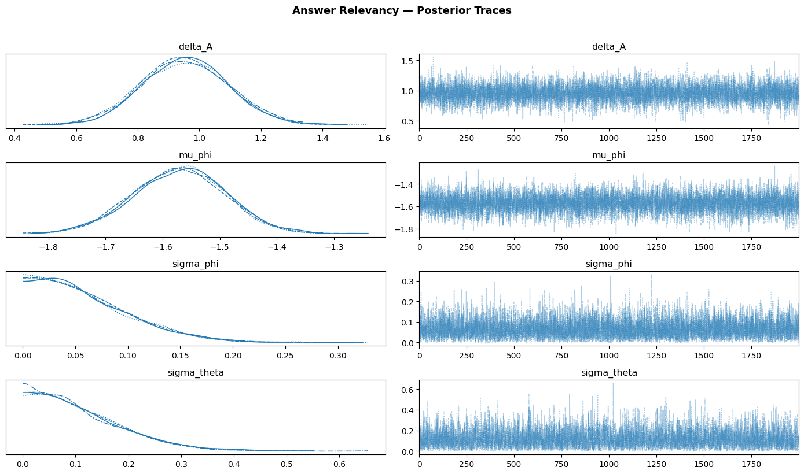
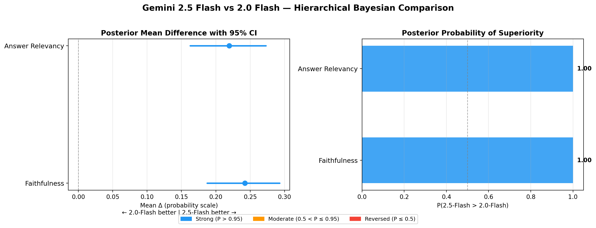
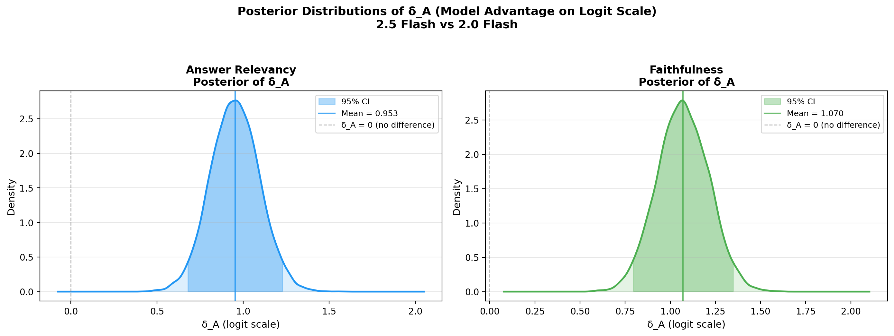
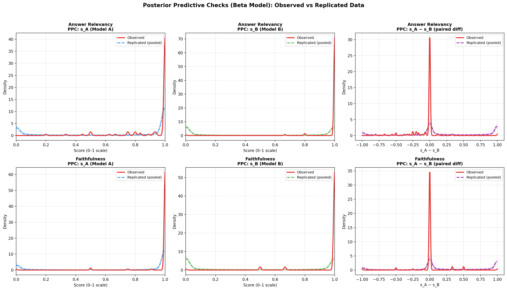
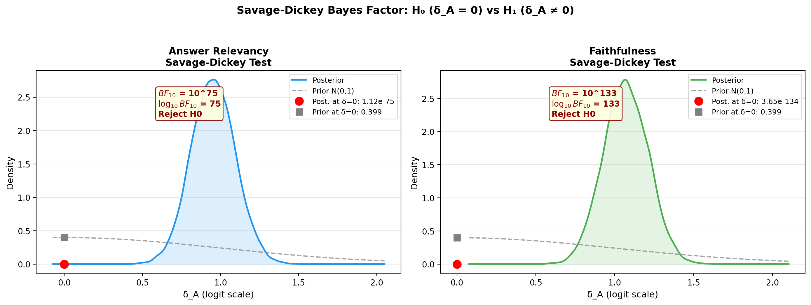
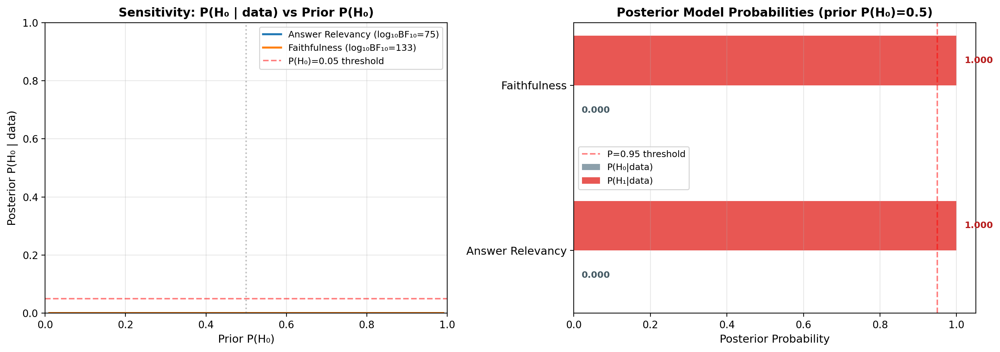
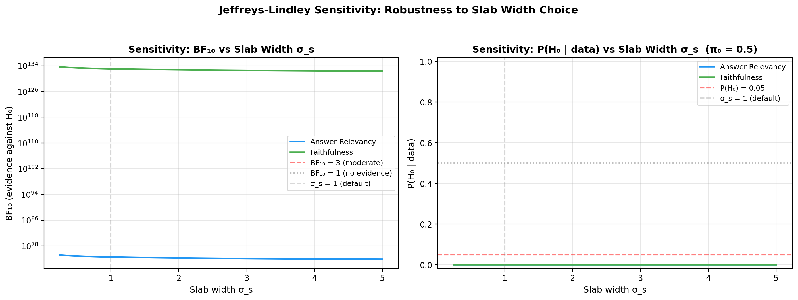

<!-- _class: lead — activates the dark title slide style defined above -->
<!-- _class: lead -->

# Hierarchical Beta-Regression with Item-Specific Precision

 

### Bayesian testing of two proportions

Comparing **Gemini 2.5 Flash** vs **Gemini 2.0 Flash**

 

Alexander Vosseler · 27 April 2026

---

## Problem Setting

- Compare two RAG generators on the same $N$ evaluation items
- Shared **TFIDF retriever** ($k=5$), same LLM judge
- Each item $i$ produces paired scores $s_{A,i}, s_{B,i} \in (0,1)$
- Metrics: **Answer Relevancy** and **Faithfulness** (DeepEval)

<!-- Block usage: "block" (blue header) for standard formulas -->

Hypothesis Test

$$H_0: \delta_A = 0 \quad \text{vs} \quad H_1: \delta_A \neq 0$$

where $\delta_A$ is the difference in average metric scores (e.g. Faithfulness) between Model A and Model B on the logit scale

> Does Model A systematically differ from Model B?

---

## Why Not Logistic-Normal?

<!-- Block usage: "block-grey" for rejected / superseded models -->

Logistic-Normal Model

$$z_{m,i} = \operatorname{logit}(s_{m,i}), \quad z_{m,i} \sim \mathcal{N}(\theta_i + \delta_m, \sigma^2)$$

**Posterior predictive checks revealed critical misfit:**

- **Observed data**: J-shaped — scores cluster near 1.0
- **Replicated data**: symmetric U-shape on $(0,1)$

The Gaussian noise on the logit scale creates unrealistic mass near 0.

---

## Why Not Global Precision?

Beta with Global Precision

$$s_{m,i} \sim \operatorname{Beta}(\mu_{m,i} \cdot \phi, \; (1-\mu_{m,i}) \cdot \phi)$$

The data contains a **mixture** of:

- **Easy items**: both models score $\approx 1.0$, need $\phi \gg 1$
- **Hard items**: scores scattered across $(0,1)$, need $\phi \approx 1$

A single $\phi$ cannot accommodate both regimes.

**Decision**: Item-specific precision $\phi_i$.

---

## Model Evolution (PPC-Driven)

| Model | PPC Result | Issue |
|-------|-----------|-------|
| Logistic-Normal | **FAIL** | U-shaped vs J-shaped observed |
| Beta (global $\phi$) | **FAIL** | Can't capture tight + diffuse items |
| Beta (item $\phi_i$) | **PASS** | Matches observed J-shape and spread |

Each iteration was rejected by **posterior predictive checks** until the data-generating process was adequately captured.

---

## Notation

| Symbol | Domain | Description |
|--------|--------|-------------|
| $\theta_i$ | $\mathbb{R}$ | Item difficulty (logit scale) |
| $\delta_A$ | $\mathbb{R}$ | Model A advantage (**key parameter**) |
| $\sigma_\theta$ | $\mathbb{R}^+$ | SD of item difficulties |
| $\phi_i$ | $\mathbb{R}^+$ | Item-specific precision |
| $\mu_\phi, \sigma_\phi$ | $\mathbb{R}, \mathbb{R}^+$ | Population parameters of $\log \phi_i$ |

---

## Generative Model — Hyperpriors

Hyperpriors

$$\sigma_\theta \sim \operatorname{HalfNormal}(1) \qquad \mu_\phi \sim \mathcal{N}(0, 2^2) \qquad \sigma_\phi \sim \operatorname{HalfNormal}(1)$$

$$\delta_A \sim \mathcal{N}(0, \sigma_s^2) \qquad \text{(fixed } \sigma_s = 1.0 \text{)}$$

---

## Generative Model — Item Level

Item Parameters

$$\theta_i \sim \mathcal{N}(0, \sigma_\theta^2) \qquad \phi_i \sim \operatorname{LogNormal}(\mu_\phi, \sigma_\phi^2)$$

Logit Link

$$\mu_{A,i} = \operatorname{sigmoid}(\theta_i + \delta_A) \qquad \mu_{B,i} = \operatorname{sigmoid}(\theta_i)$$

---

## Generative Model — Likelihood

Beta Likelihood (Item-Specific Precision)

$$s_{A,i} \sim \operatorname{Beta}\!\left(\mu_{A,i} \cdot \phi_i, \; (1 - \mu_{A,i}) \cdot \phi_i\right)$$

$$s_{B,i} \sim \operatorname{Beta}\!\left(\mu_{B,i} \cdot \phi_i, \; (1 - \mu_{B,i}) \cdot \phi_i\right)$$

Both models share the same $\phi_i$ per item — item difficulty drives precision variability more than model identity.

---

## Key Design Choices

1. **LogNormal precision** — ensures $\phi_i > 0$, allows heavy-tailed variation
   - Easy items → large $\phi_i$ (tight)
   - Hard items → small $\phi_i$ (diffuse)

2. **Non-centered parameterization** — avoids funnel geometry in NUTS

3. **Fixed slab width $\sigma_s$** — essential for Savage-Dickey BF

4. **Shared $\phi_i$** — same retriever, same context per item

---

## Non-Centered Parameterization

Avoids the funnel geometry that degrades NUTS sampling:

Non-Centered Transform

$$\theta_i^{\text{raw}} \sim \mathcal{N}(0,1), \quad \theta_i = \sigma_\theta \cdot \theta_i^{\text{raw}}$$

$$\phi_i^{\text{raw}} \sim \mathcal{N}(0,1), \quad \log \phi_i = \mu_\phi + \sigma_\phi \cdot \phi_i^{\text{raw}}$$

Critical when population SDs ($\sigma_\theta$, $\sigma_\phi$) are small.

---

## MCMC Configuration

| Parameter | Value |
|-----------|-------|
| Sampler | NUTS (PyMC) |
| Chains | 4 |
| Warmup | 2,000 |
| Draws / chain | 2,000 |
| Total draws | 8,000 |
| Target accept | 0.99 |

High accept rate needed — Beta likelihood with near-boundary data creates sharp posterior curvature.

---

## MCMC Diagnostics: Trace Plots

---

## Posterior Quantities

**Logit scale:**
- Marginal posterior $p(\delta_A \mid \mathbf{s}_A, \mathbf{s}_B)$
- 95% credible interval

**Probability scale** — population-averaged difference:

Score Difference

$$\Delta^{(s)} = \frac{1}{N} \sum_{i=1}^{N} \left(\mu_{A,i}^{(s)} - \mu_{B,i}^{(s)}\right)$$

---

## Decision Quantities

| Quantity | Interpretation |
|----------|----------------|
| Mean $\Delta$ | Expected score advantage of A over B |
| 95% CI of $\Delta$ | Posterior uncertainty interval |
| $P(A > B)$ | Posterior probability that A is better |

Posterior Probability of Superiority

$$P(A > B) = \frac{1}{S}\sum_s \mathbb{1}[\Delta^{(s)} > 0]$$

---

## Results: Forest Plot & P(A > B)

---

## Results: Posterior of $\delta_A$

---

## Simulation Validation

Validate parameter recovery before real data:

- **DGP**: $N=200$, $\delta_A^{\text{true}} = 0.5$, $\sigma_\theta = 1.0$
- **Recovery**: $\hat{\delta}_A = 0.473$ — good recovery
- All $\hat{r} = 1.0$ — chains converged
- 95% CI covers the true value

Confirms model and inference pipeline are correctly implemented.

---

## Posterior Predictive Checks

For each posterior draw, generate replicated data:

Replicated Data

$$s_{m,i}^{\text{rep}} \sim \operatorname{Beta}\!\left(\mu_{m,i}^{(s)} \cdot \phi_i^{(s)},\; (1 - \mu_{m,i}^{(s)}) \cdot \phi_i^{(s)}\right)$$

Compare against observed data on:
1. Marginal distribution of $s_A$
2. Marginal distribution of $s_B$
3. Paired difference $s_A - s_B$

---

## PPC Results

---

## PPC p-values

Two-sided posterior predictive p-value:

PPC p-value

$$p = 2 \cdot \min\!\left(P(T^{\text{rep}} \geq T^{\text{obs}}),\; P(T^{\text{rep}} \leq T^{\text{obs}})\right)$$

- $p > 0.05$: model adequately reproduces this statistic
- $p < 0.05$: potential misfit

Summary statistics $T$: mean, std, mean difference, std of difference.

---

## Savage-Dickey Bayes Factor

### The Measure-Theoretic Problem

Under a continuous prior, $\{\delta_A = 0\}$ has **Lebesgue measure zero** — it can never get positive posterior probability.

Spike-and-Slab Prior

$$\pi(\delta_A) = \pi_0 \cdot \delta_{\{0\}}(\delta_A) + (1 - \pi_0) \cdot g(\delta_A)$$

---

## The Savage-Dickey Density Ratio

Since $H_0$ is nested in $H_1$:

Savage-Dickey Density Ratio

$$BF_{01} = \frac{p(\delta_A = 0 \mid D, H_1)}{g(0)} \qquad \text{where } g(0) = \frac{1}{\sigma_s \sqrt{2\pi}}$$

- **Numerator**: posterior density at 0, estimated via KDE on 8,000 draws
- **Denominator**: slab prior density at 0 (analytical)

---

## Savage-Dickey: Results

---

## Why Savage-Dickey?

1. **MCMC reuse** — no additional model fitting needed
2. **Analytical denominator** — only KDE approximation in numerator
3. **Prior consistency** — fixed $\sigma_s$ ensures numerator and denominator refer to the same $H_1$

A hierarchical $\sigma_s$ would make $g(0)$ diverge:

Divergent Marginal Prior

$$g(0) = \int_0^\infty \frac{1}{\sigma_s \sqrt{2\pi}} \cdot \operatorname{HalfNormal}(\sigma_s) \, d\sigma_s \to \infty$$

---

## Jeffreys Interpretation Scale

| $BF_{10}$ | Evidence against $H_0$ |
|-----------|----------------------|
| $< 1$ | Supports $H_0$ |
| $1 – 3$ | Anecdotal |
| $3 – 10$ | Moderate |
| $10 – 30$ | Strong |
| $30 – 100$ | Very strong |
| $> 100$ | Decisive |

For extreme values: display as $\log_{10} BF_{10}$.

---

## From BF to Posterior Model Probability

Posterior Model Probability

$$P(H_0 \mid D) = \frac{\pi_0 \cdot BF_{01}}{\pi_0 \cdot BF_{01} + (1 - \pi_0)}$$

With agnostic prior $\pi_0 = 0.5$:

Simplified (Equal Prior Odds)

$$P(H_0 \mid D) = \frac{BF_{01}}{1 + BF_{01}}$$

A well-defined probability statement — the spike mass ensures $\{\delta_A = 0\}$ has positive prior and posterior measure.

---

## Sensitivity Analysis

### Prior $P(H_0)$

Sweep $\pi_0$ from 0.01 to 0.99 — does the conclusion hold?

---

## Sensitivity: Slab Width (Jeffreys-Lindley)

Sweep $\sigma_s \in [0.25, 5.0]$ — is the BF robust?

---

## Connection to Item Response Theory

| IRT Concept | Our Model |
|-------------|-----------|
| Person ability | Model effect $\delta_A$ |
| Item difficulty | $\theta_i$ |
| Response | Continuous $s_{m,i} \in (0,1)$ |
| Link function | Logistic sigmoid |
| Discrimination | Fixed at 1 (Rasch-like) |
| Response distribution | Beta (vs Bernoulli in IRT) |

$\phi_i$ acts as item-specific **reliability** — analogous to IRT discrimination.

---

## Why Not McNemar or Wilcoxon?

| Aspect | McNemar / Wilcoxon | Our Model |
|--------|-------------------|-----------|
| Data used | Binary or rank-based | Full continuous $(0,1)$ |
| Item heterogeneity | Ignored | $\theta_i$ |
| Precision heterogeneity | Ignored | $\phi_i$ |
| Effect size | None / limited | $\Delta$, 95% CI, $P(A>B)$ |
| Evidence for $H_0$ | Cannot provide | $BF_{01}$, $P(H_0 \mid D)$ |

Frequentist tests can serve as a **robustness footnote** — confirming under a simpler framework.

---

## Assumptions & Limitations

1. Scores clipped to $(\varepsilon, 1-\varepsilon)$ for Beta support
2. Shared $\phi_i$ — could relax to model-specific precision
3. Single scalar $\delta_A$ — no item × model interactions
4. Exchangeable items — no topic clustering
5. Fixed slab width — validated via sensitivity sweep
6. KDE approximation — reliable with 8,000 draws

---

## Complete Pipeline

1. **Data prep** — Chunk docs, load Q/A, build TFIDF retriever
2. **Evaluation** — Score both models with DeepEval
3. **Simulation** — Validate parameter recovery ($\delta_A = 0.5$)
4. **Inference** — Fit hierarchical Beta model per metric
5. **Diagnostics** — Trace plots, $\hat{r}$, ESS, PPC
6. **Hypothesis test** — Savage-Dickey $BF_{10}$, $P(H_0 \mid D)$
7. **Sensitivity** — Sweep $\pi_0$ and $\sigma_s$

---

## Summary

- **Beta likelihood** with **item-specific LogNormal precision** — validated by PPC
- **Paired design** isolates the generator effect
- **Savage-Dickey BF** — reuses MCMC draws, no extra model fitting
- **Full posterior inference**: $\Delta$, 95% CI, $P(A > B)$, $P(H_0 \mid D)$
- **Sensitivity analysis** confirms robustness to prior choices

---

<!-- _class: lead -->

# Thank you for your $\;\;\operatorname{softmax}\!\left(\frac{Q \cdot K^\top}{\sqrt{d_k}}\right) \cdot V$
