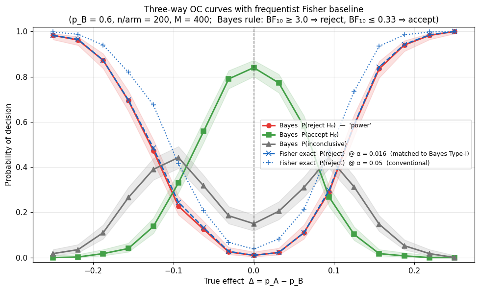
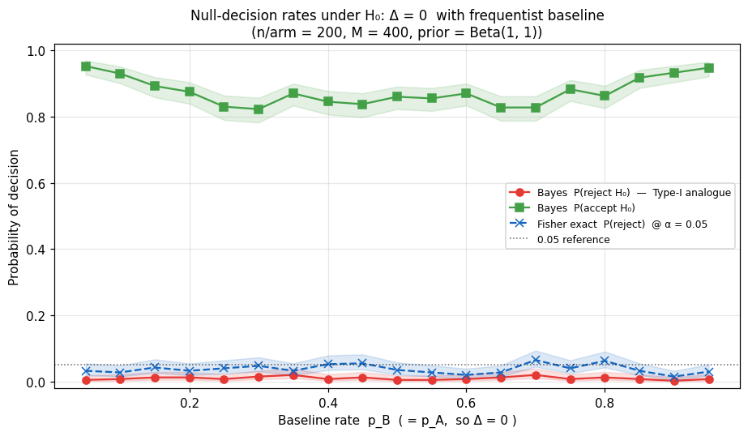
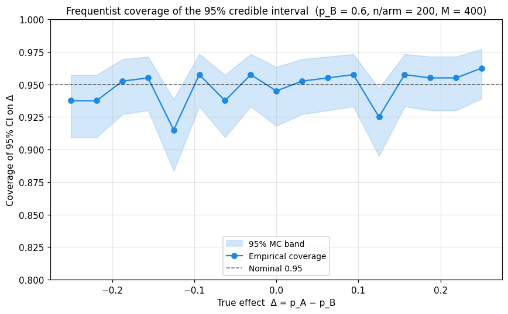
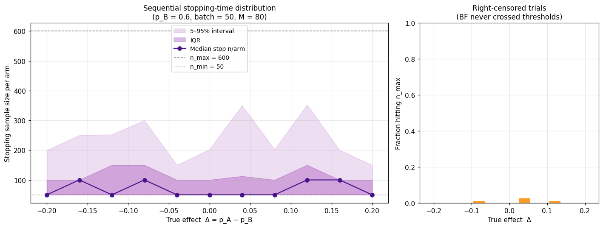

# Frequentist Evaluation

A Bayesian *model* doesn't have a Type-I error, but the moment we wrap
it in a **decision rule** — e.g. *"reject $H_0$ if $BF_{10} \geq 3$,
accept if $BF_{10} \leq 1/3$, otherwise inconclusive"* — the rule is a
function from data to a decision and therefore has well-defined
frequentist operating characteristics. Estimating those by Monte-Carlo
simulation is the standard *calibrated Bayes* check (Rubin 1984;
Little 2006).

This page is about evaluating the chosen procedure *after* you've
fixed its parameters. For the complementary question — *how do I pick
the sample size in the first place?* — see
[BFDA](bfda.md).

## What to estimate

Four diagnostics together replace a single "power curve" — the power
curve is the wrong object for a Bayesian rule because it cannot
represent the *inconclusive* zone:

| Diagnostic | What it answers |
|---|---|
| **Three-way OC** | `P(reject H₀)`, `P(accept H₀)`, `P(inconclusive)` as functions of the true effect `Δ = p_A − p_B` |
| **Null-decision sweep** | `P(reject H₀ \| Δ = 0)` swept over the baseline rate `p_B` (BFs on proportions are *not* translation-invariant in `p`) |
| **CI coverage** | Frequentist coverage of the 95 % credible interval on `Δ` |
| **Sequential stopping-time distribution** | Empirical distribution of the per-arm sample size at which `SequentialNonPairedBayesPropTest` stops |

## Three-way decision classifier

Use `classify_bf` so the simulated OC analysis and the deployed
sequential procedure share **one** decision boundary:

```python
from bayesprop.resources.bayes_nonpaired import classify_bf

bf10 = model.fit(y_A, y_B).savage_dickey_test().BF_10
category = classify_bf(bf10, bf_upper=3.0, bf_lower=1.0 / 3.0)
# → "reject" | "accept" | "inconclusive"
```

See [Decision Rules → Three-way classification](decision_rules.md#three-way-classification-classify_bf)
for the threshold conventions.

## Frequentist baseline (Fisher's exact)

For a like-for-like comparison against a classical test, run Fisher's
exact two-proportion test on the *same* simulated data:

```python
from bayesprop.utils.utils import (
    fisher_exact_nonpaired_test,
    simulate_nonpaired_scores,
)

sim = simulate_nonpaired_scores(N=200, theta_A=0.75, theta_B=0.60)
freq = fisher_exact_nonpaired_test(sim.y_A, sim.y_B)
print(f"Fisher p = {freq.p_value:.4f},  OR = {freq.odds_ratio:.3f}")
```

This is most useful as a **calibration reference** for OC plots: pick
a frequentist α such that the empirical Type-I rate at `Δ = 0`
matches the Bayes BF rule's Type-I rate, then overlay the two power
curves. If the matched-α frequentist curve tracks the Bayes
`P(reject H₀)` curve closely, the Bayes procedure is paying nothing
in efficiency for the bonus of an explicit `P(accept H₀)` zone.

## Pre-built OC simulation harness

The full simulation logic — grid sweeps for the three-way OC plot,
matched-α calibration, CI coverage tracking, Wilson Monte-Carlo bands
and the sequential stopping-time distribution — lives in
`bayesprop.utils.operation_characteristics`. The notebook
`src/notebooks/operating_characteristics_nonpaired.ipynb` is a thin
orchestration layer on top of it, so you can call the same functions
directly from your own scripts:

```python
import numpy as np
from bayesprop.utils.operation_characteristics import (
    grid_fixed_n,
    matched_calibration_alpha,
    simulate_sequential,
    wilson_band,
)

grid = [(round(0.6 + d, 4), 0.6) for d in np.linspace(-0.2, 0.2, 11)]
df_oc, pvals = grid_fixed_n(
    grid, n=200, n_sim=400, seed=20260514,
    alpha0=1.0, beta0=1.0, bf_upper=3.0, bf_lower=1.0 / 3.0,
)
idx_null = int(np.argmin(np.abs(df_oc["delta"])))
alpha_matched = matched_calibration_alpha(
    pvals, df_oc.iloc[idx_null]["reject"], idx_null,
)
lo, hi = wilson_band(df_oc["reject"].to_numpy(), n_sim=400)

seq = simulate_sequential(
    p_A=0.75, p_B=0.55, n_sim=80, rng=np.random.default_rng(0),
    n_min=50, n_max=600, batch_size=50,
)
```

See [API → Operating Characteristics](../api/operation_characteristics.md)
for the full reference.

## Worked example — the four diagnostic plots

The plots below are produced end-to-end by the notebook above with
`p_B = 0.6`, `n_per_arm = 200`, `M = 400` replicates, prior
`Beta(1, 1)`, and BF thresholds `(3, 1/3)`. Shaded bands are 95 %
Wilson Monte-Carlo bands.

### Plot 1 — Three-way OC curves with matched-α frequentist baseline

Bayesian `P(reject H₀)`, `P(accept H₀)`, `P(inconclusive)` as functions
of the true effect `Δ = p_A − p_B`, with two Fisher overlays
(α = 0.05 and the Bayes-matched α).



### Plot 2 — Null-decision rates swept over the baseline rate

Type-I analogue. The Bayes `P(reject H₀)` curve under `p_A = p_B = p`,
plus the Fisher α = 0.05 reference. Because BFs on proportions are
*not* translation-invariant in `p`, it pays to look at the whole curve,
not just at `p = 0.5`.



### Plot 3 — Credible-interval coverage of `Δ`

Frequentist coverage of the 95 % equal-tailed posterior interval on
`Δ`. Should hover near the nominal 0.95 across the grid; small
deviations near the boundaries (`p_A` near 0 or 1) are expected.



### Plot 4 — Sequential stopping-time distribution

Median (and IQR / 5–95 % bands) of the per-arm stopping sample size of
`SequentialNonPairedBayesPropTest`, as a function of the true effect.
Trials that hit `n_max` are right-censored and reported separately.



## What can go wrong

These plots are a quick health check on the procedure. Typical failure
modes a regression will surface:

* CI coverage drifts well off 0.95 → prior / likelihood combination is
  biased somewhere in the parameter space.
* The null-decision curve climbs above the nominal level → Type-I
  inflation under some `p_B`; consider stricter BF thresholds.
* Asymmetric power around `Δ = 0` → the procedure (or the prior) is not
  symmetric in the way you expected.
* Sequential censoring spikes → `n_max` is too low for the effect
  sizes you actually care about; raise it or relax the thresholds.

## References

1. **Rubin** (1984). Bayesianly justifiable and relevant frequency
   calculations for the applied statistician. *The Annals of Statistics*,
   12(4), 1151–1172.
2. **Little** (2006). Calibrated Bayes: A Bayes/frequentist roadmap.
   *The American Statistician*, 60(3), 213–223.
3. **Brown, Cai & DasGupta** (2001). Interval estimation for a
   binomial proportion. *Statistical Science*, 16(2), 101–133.

## API

See [API Reference — Operating Characteristics](../api/operation_characteristics.md)
for full function documentation.
