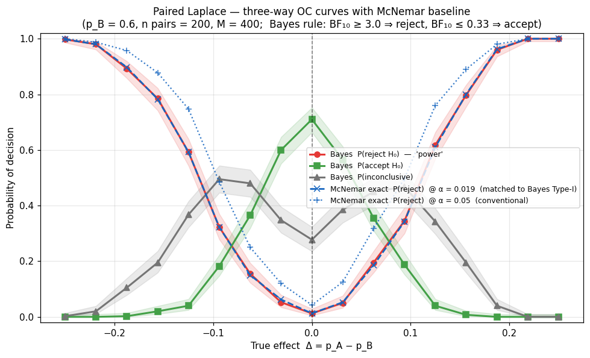
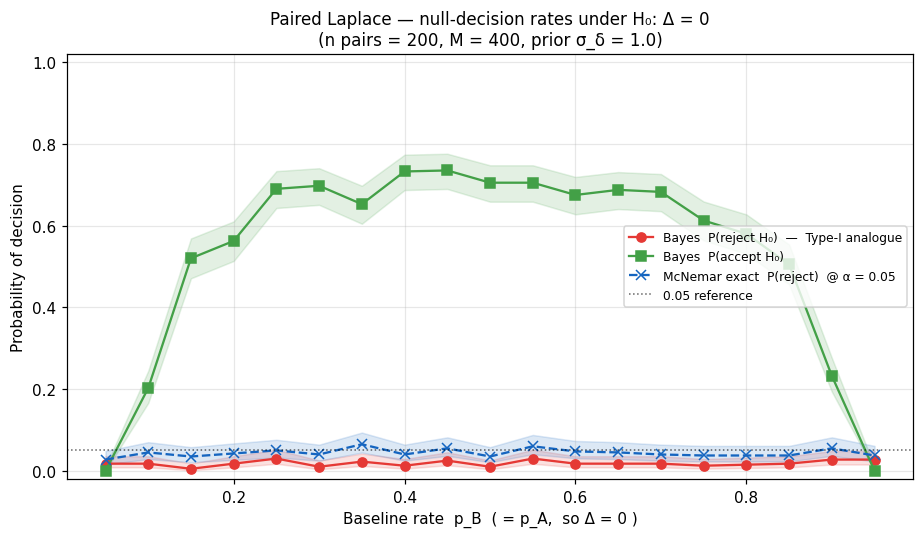
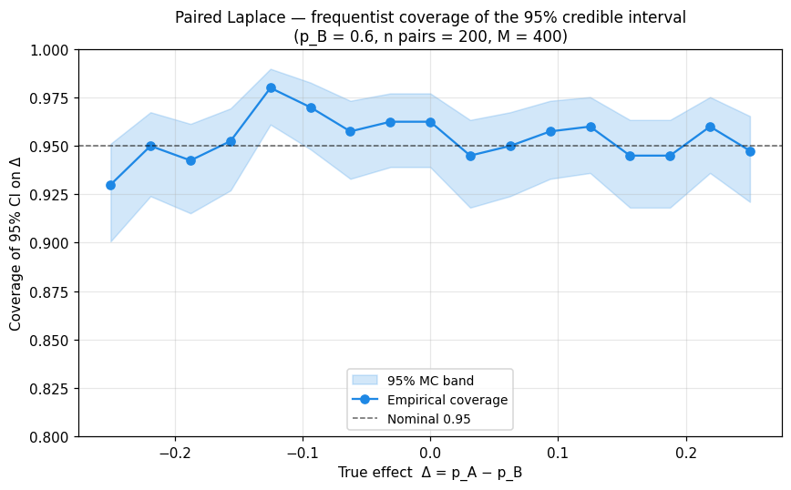
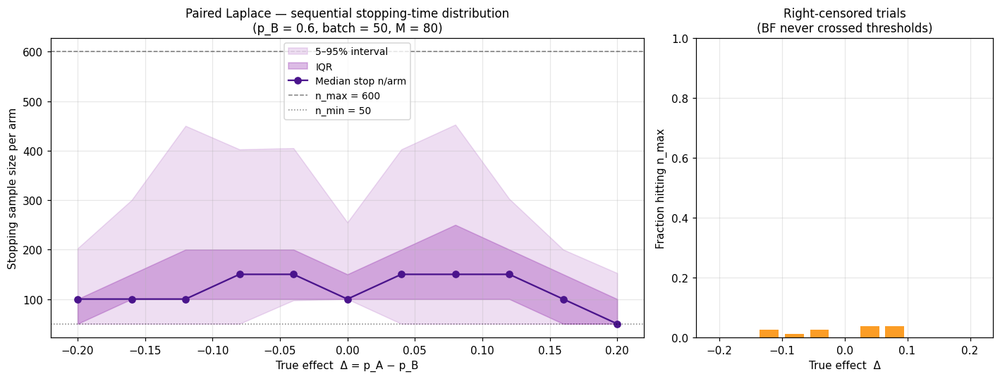

# Frequentist Evaluation — Paired Laplace

This page is the paired counterpart of
[Frequentist Evaluation](frequentist_evaluation.md): it answers the
same four diagnostic questions but for the *paired* procedure built
around the Laplace-approximation model
[`PairedBayesPropTest`](../api/bayes_paired_laplace.md) and its sequential
variant `SequentialPairedBayesPropTest`.

The data contract is paired binary outcomes — every observation
$i \in \{1,\dots,n\}$ contributes a *pair* $(y_{A,i}, y_{B,i})$.
The analysis model is

$$
y_{A,i} \sim \text{Bern}\bigl(\sigma(\mu + \delta_A)\bigr), \qquad
y_{B,i} \sim \text{Bern}\bigl(\sigma(\mu)\bigr),
$$

with prior $\delta_A \sim \mathcal{N}(0, \sigma_\delta^2)$ on the
logit-scale effect. The Savage–Dickey BF tests
$H_0: \delta_A = 0$, equivalent to $H_0: p_A = p_B$.

For the complementary *sample-size planning* question see
[BFDA](bfda.md). For the underlying decision-rule conventions see
[Decision Rules](decision_rules.md).

## What to estimate

| Diagnostic | What it answers |
|---|---|
| **Three-way OC** | `P(reject H₀)`, `P(accept H₀)`, `P(inconclusive)` as functions of the true effect `Δ = p_A − p_B` |
| **Null-decision sweep** | `P(reject H₀ \| Δ = 0)` swept over the baseline rate `p_B` (the logit prior on `δ_A` is not translation-invariant on the probability scale) |
| **CI coverage** | Frequentist coverage of the 95 % credible interval on `Δ` derived from the Laplace posterior |
| **Sequential stopping-time distribution** | Empirical distribution of the per-arm sample size at which `SequentialPairedBayesPropTest` stops |

## Three-way decision classifier

The same `classify_bf` helper is used here so the simulated OC analysis
and the deployed sequential paired procedure share **one** decision
boundary:

```python
from bayesprop.resources.bayes_nonpaired import classify_bf
from bayesprop.resources.bayes_paired_laplace import PairedBayesPropTest

bf10 = PairedBayesPropTest().fit(y_A, y_B).savage_dickey_test().BF_10
category = classify_bf(bf10, bf_upper=3.0, bf_lower=1.0 / 3.0)
# → "reject" | "accept" | "inconclusive"
```

See [Decision Rules → Three-way classification](decision_rules.md#three-way-classification-classify_bf)
for the threshold conventions.

## Frequentist baseline (McNemar's exact test)

For paired binary data the canonical frequentist analogue of Fisher's
exact test is **McNemar's exact test**, which conditions on the
discordant pairs $b = \#\{i: y_{A,i}=1, y_{B,i}=0\}$ and
$c = \#\{i: y_{A,i}=0, y_{B,i}=1\}$. Under $H_0: p_A = p_B$ and
conditional on $b+c$, $b \sim \text{Binomial}(b+c, 0.5)$. The library
ships a small wrapper that mirrors the data contract of the Bayesian
paired test:

```python
from bayesprop.utils.utils import mcnemar_paired_test, simulate_paired_scores

sim = simulate_paired_scores(N=200, mu=0.0, delta_A=0.5)
freq = mcnemar_paired_test(sim.y_A, sim.y_B)
print(f"McNemar p = {freq.p_value:.4f},  OR = {freq.odds_ratio}")
```

The exact binomial p-value is used when the discordant count
$b + c \leq 25$; otherwise the standard $\chi^2$ approximation is used.
As in the non-paired case the most useful application is as a
**calibration reference**: pick a frequentist $\alpha$ such that the
empirical Type-I rate at $\Delta = 0$ matches the Bayes BF rule's
Type-I rate, then overlay the two power curves.

## Pre-built OC simulation harness

The full simulation logic — grid sweeps for the three-way OC plot,
matched-$\alpha$ calibration, CI coverage tracking, Wilson Monte-Carlo
bands and the sequential stopping-time distribution — lives in
`bayesprop.utils.operation_characteristics_paired`. The notebook
`src/notebooks/operating_characteristics_paired_laplace.ipynb` is a
thin orchestration layer on top of it, so you can call the same
functions directly from your own scripts:

```python
import numpy as np
from bayesprop.utils.operation_characteristics_paired import (
    grid_fixed_n_paired,
    matched_calibration_alpha,
    simulate_sequential_paired,
    wilson_band,
)

grid = [(round(0.6 + d, 4), 0.6) for d in np.linspace(-0.2, 0.2, 11)]
df_oc, pvals = grid_fixed_n_paired(
    grid, n=200, n_sim=400, seed=20260514,
    prior_sigma_delta=1.0, bf_upper=3.0, bf_lower=1.0 / 3.0,
)
idx_null = int(np.argmin(np.abs(df_oc["delta"])))
alpha_matched = matched_calibration_alpha(
    pvals, df_oc.iloc[idx_null]["reject"], idx_null,
)
lo, hi = wilson_band(df_oc["reject"].to_numpy(), n_sim=400)

seq = simulate_sequential_paired(
    p_A=0.75, p_B=0.55, n_sim=80, rng=np.random.default_rng(0),
    n_min=50, n_max=600, batch_size=50,
)
```

See [API → Operating Characteristics (Paired)](../api/operation_characteristics_paired.md)
for the full reference.

## Worked example — the four diagnostic plots

The plots below are produced end-to-end by the paired notebook above
with `p_B = 0.6`, `n pairs = 200`, `M = 400` replicates, prior
$\sigma_\delta = 1.0$ on the logit-scale effect, and BF thresholds
$(3, 1/3)$. Shaded bands are 95 % Wilson Monte-Carlo bands.

### Plot 1 — Three-way OC curves with matched-α McNemar baseline

Bayesian `P(reject H₀)`, `P(accept H₀)`, `P(inconclusive)` as
functions of the true effect `Δ = p_A − p_B`, with two McNemar
overlays (α = 0.05 and the Bayes-matched α). Compared with the
non-paired counterpart at the same `(Δ, n)`, the paired reject curve
is materially steeper — that's the variance reduction from pairing
showing up in the operating characteristic.



### Plot 2 — Null-decision rates swept over the baseline rate

Type-I analogue. The Bayes `P(reject H₀)` curve under `p_A = p_B = p`,
plus the McNemar α = 0.05 reference. The logit-scale prior on
$\delta_A$ is symmetric in logit space but its probability-scale
projection is squeezed toward zero near the boundary, so the null
curve is *not* flat across `p`.



### Plot 3 — Credible-interval coverage of `Δ`

Frequentist coverage of the 95 % equal-tailed posterior interval on
`Δ`, derived from the Laplace posterior on $(\mu, \delta_A)$ pushed
through $\sigma(\mu + \delta_A) - \sigma(\mu)$. Should hover near the
nominal 0.95 across the grid; deviations at extreme `Δ` are the
regime where the second-order Laplace approximation starts to break
down.



### Plot 4 — Sequential stopping-time distribution

Median (and IQR / 5–95 % bands) of the per-arm stopping sample size of
`SequentialPairedBayesPropTest`, as a function of the true effect.
Trials that hit `n_max` are right-censored and reported separately.
At decisive effects (`|Δ| ≳ 0.15`) the paired procedure typically
stops in well under 200 pairs.



## What can go wrong

The same failure modes as in the non-paired case apply, plus one
paired-specific one:

* CI coverage drifts well off 0.95 → either the Laplace approximation
  is breaking (try a richer model or check the Newton solve converged)
  or the prior on $\delta_A$ is biased for that part of the parameter
  space.
* The null-decision curve climbs above the nominal level → Type-I
  inflation under some `p_B`; consider a tighter $\sigma_\delta$ or
  stricter BF thresholds.
* Asymmetric power around `Δ = 0` → expected near boundary `p_B`
  because of the logit-scale prior; check the symmetry breaks line up
  with the prior's implicit asymmetry on the probability scale.
* Sequential censoring spikes → `n_max` is too low for the effect
  sizes you actually care about; raise it or relax the thresholds.

## References

1. **Rubin** (1984). Bayesianly justifiable and relevant frequency
   calculations for the applied statistician. *The Annals of
   Statistics*, 12(4), 1151–1172.
2. **Little** (2006). Calibrated Bayes: A Bayes/frequentist roadmap.
   *The American Statistician*, 60(3), 213–223.
3. **McNemar** (1947). Note on the sampling error of the difference
   between correlated proportions or percentages. *Psychometrika*,
   12(2), 153–157.
4. **Brown, Cai & DasGupta** (2001). Interval estimation for a
   binomial proportion. *Statistical Science*, 16(2), 101–133.

## API

See [API Reference — Operating Characteristics (Paired)](../api/operation_characteristics_paired.md)
for full function documentation.
