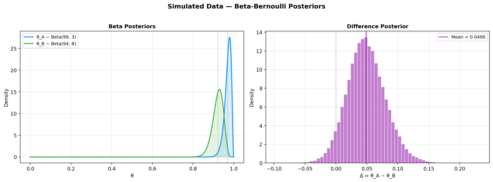
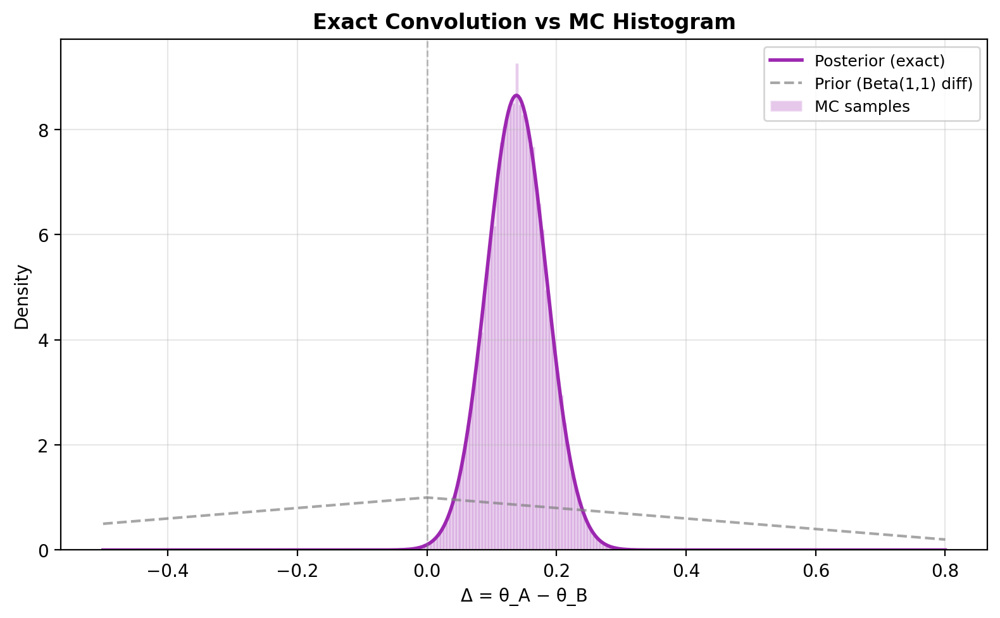
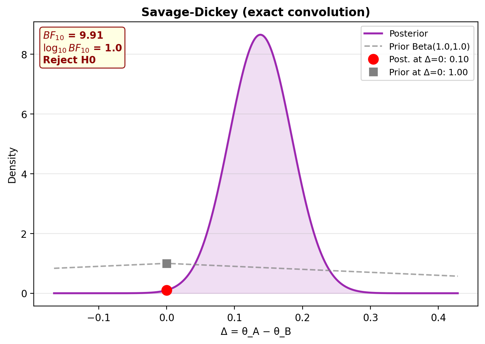
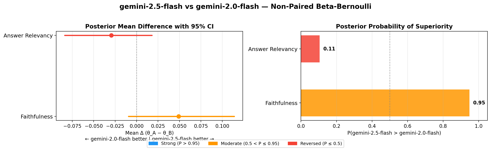
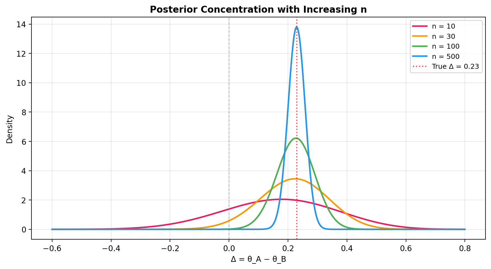
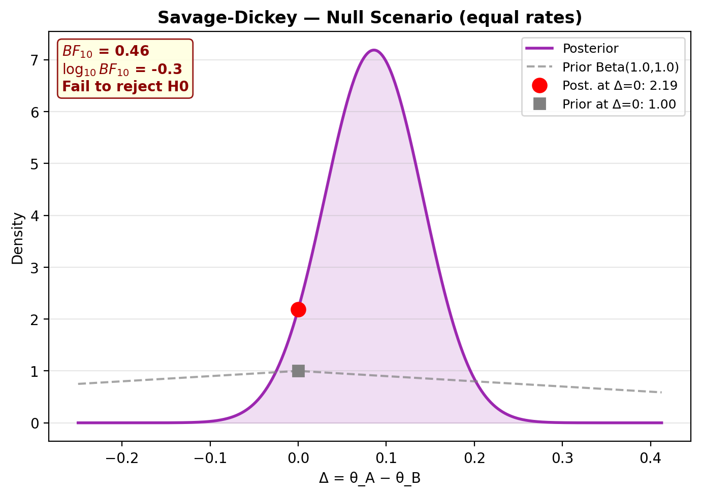
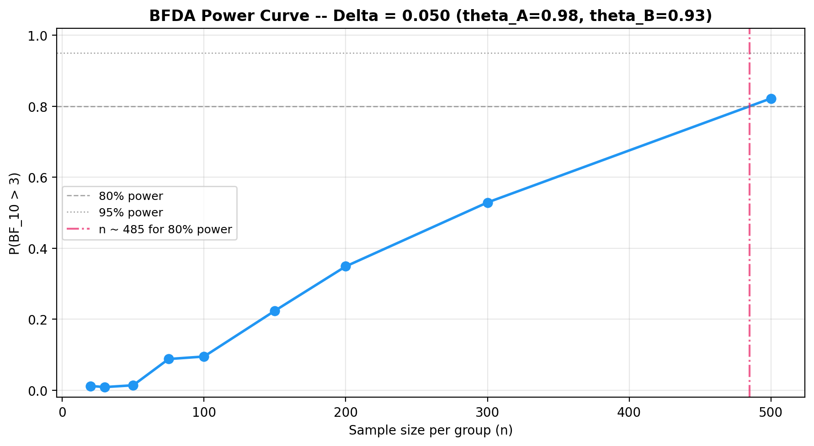
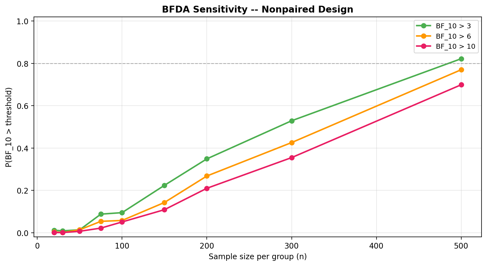

# Non-Paired Beta-Bernoulli Model

## Overview

The non-paired model compares two **independent** groups using a conjugate
Beta-Bernoulli model. Each group has its own success probability
$\theta_A$ and $\theta_B$, estimated independently from binarized
pass/fail data.

Use this model when model A and model B are evaluated on **different** items
(i.e. the observations are not paired).

## Generative model

$$
\theta_A \sim \text{Beta}(\alpha_0, \beta_0) \qquad
\theta_B \sim \text{Beta}(\alpha_0, \beta_0)
$$

$$
y_{A,i} \sim \text{Bernoulli}(\theta_A), \quad i = 1, \dots, n_A \qquad
y_{B,j} \sim \text{Bernoulli}(\theta_B), \quad j = 1, \dots, n_B
$$

The posterior is available in closed form via conjugacy:

$$
\theta_A \mid y_A \sim \text{Beta}(\alpha_0 + k_A,\; \beta_0 + n_A - k_A)
$$

where $k_A = \sum_{i} y_{A,i}$ is the number of successes (and analogously for group B).

### Directed Acyclic Graph (DAG)


<small>**Legend:** grey = hyperparameters, blue = latent parameters,
yellow = observed data.</small>

## Difference posterior (exact convolution)

The distribution of $\Delta = \theta_A - \theta_B$ is computed via
**exact log-space convolution** of two Beta densities, not KDE. This avoids
bandwidth selection issues and gives deterministic, reproducible results.

Because the two posteriors are independent, the density of $\Delta$ is the
convolution of $f_{\theta_A \mid y}$ with the reflected density of
$\theta_B \mid y$. Setting $\theta_A = \theta_B + z$, for $z \in (-1, 1)$:

$$
f_{\Delta \mid y}(z) = \int_{\max(0,\,z)}^{\min(1,\,1+z)}
  f_{\theta_A \mid y}(x) \;\cdot\; f_{\theta_B \mid y}(x - z) \;\mathrm{d}x
$$

Substituting the two conjugate posteriors
$\theta_A \mid y \sim \text{Beta}(a_A, b_A)$ and
$\theta_B \mid y \sim \text{Beta}(a_B, b_B)$ with
$a_A = \alpha_0 + k_A$, $b_A = \beta_0 + n_A - k_A$ (and analogously for $B$):

$$
f_{\Delta \mid y}(z) = \frac{1}{B(a_A, b_A)\, B(a_B, b_B)}
  \int_{\max(0,\,z)}^{\min(1,\,1+z)}
    x^{a_A - 1}\,(1 - x)^{b_A - 1}\,
    (x - z)^{a_B - 1}\,(1 - x + z)^{b_B - 1}
  \;\mathrm{d}x
$$

where $B(\cdot, \cdot)$ is the Beta function. The integral has no closed form
in general; it is evaluated numerically on a fine grid with the integrand
computed in log-space for numerical stability (see `beta_diff_pdf` in
`bayesprop.resources.bayes_nonpaired`).

## Savage-Dickey Bayes Factor

The hypothesis test $H_0\!: \Delta = 0$ vs $H_1\!: \Delta \neq 0$ uses
the Savage-Dickey density ratio:

$$
BF_{01} = \frac{f_\Delta^{\text{post}}(0)}{f_\Delta^{\text{prior}}(0)}
\qquad\Longrightarrow\qquad
BF_{10} = \frac{1}{BF_{01}}
$$

Both densities are computed via exact convolution (no KDE needed), so the
Bayes factor is fully deterministic.

## Step-by-step example

### 1. Simulate data

```python
from bayesprop.utils.utils import simulate_nonpaired_scores
from bayesprop.resources.bayes_nonpaired import NonPairedBayesPropTest

sim = simulate_nonpaired_scores(N=150, theta_A=0.80, theta_B=0.60, seed=42)

print(f"True θ_A = {sim.theta_A:.2f},  θ_B = {sim.theta_B:.2f}")
print(f"True Δ   = {sim.theta_A - sim.theta_B:.2f}")
print(f"Observed rates: A = {sim.y_A.mean():.3f},  B = {sim.y_B.mean():.3f}")
```

### 2. Fit the model

```python
model = NonPairedBayesPropTest(
    alpha0=1.0,      # Beta(1,1) = uniform prior
    beta0=1.0,
    seed=42,
    n_samples=50_000,
).fit(sim.y_A, sim.y_B)

s = model.summary
print(f"Mean Δ (θ_A − θ_B) = {s.mean_delta:+.4f}")
print(f"95% CI = [{s.ci_95.lower:.4f}, {s.ci_95.upper:.4f}]")
print(f"P(A > B) = {s.p_A_greater_B:.4f}")
```

### 3. Unified decision (BF + P(H₀) + ROPE)

```python
d = model.decide()

print(f"Bayes Factor:  BF₁₀ = {d.bayes_factor.BF_10:.2f}  → {d.bayes_factor.decision}")
print(f"Posterior Null: P(H₀|D) = {d.posterior_null.p_H0:.4f}  → {d.posterior_null.decision}")
print(f"ROPE:          {d.rope.decision}  ({d.rope.pct_in_rope:.1%} in ROPE)")
```

### 4. Plot posteriors

```python
model.plot_posteriors(title="Beta-Bernoulli Posteriors")
```



### 5. Exact convolution vs Monte Carlo

Visualise the exact density of $\Delta$ alongside MC samples:

```python
import numpy as np
import matplotlib.pyplot as plt
from bayesprop.resources.bayes_nonpaired import beta_diff_pdf

z_grid = np.linspace(-0.5, 0.8, 500)

post_density = np.array([
    beta_diff_pdf(z, model.a_A, model.b_A, model.a_B, model.b_B)
    for z in z_grid
])
prior_density = np.array([
    beta_diff_pdf(z, 1.0, 1.0, 1.0, 1.0)
    for z in z_grid
])

fig, ax = plt.subplots(figsize=(8, 5))
ax.plot(z_grid, post_density, color="#9C27B0", linewidth=2, label="Posterior (exact)")
ax.fill_between(z_grid, post_density, alpha=0.15, color="#9C27B0")
ax.plot(z_grid, prior_density, color="gray", linewidth=1.5, linestyle="--",
        alpha=0.7, label="Prior (Beta(1,1) diff)")
ax.hist(model.delta_samples, bins=80, density=True, alpha=0.25, color="#9C27B0",
        edgecolor="white", label="MC samples")
ax.axvline(0, color="gray", linestyle="--", linewidth=1, alpha=0.5)
ax.set_xlabel("Δ = θ_A − θ_B")
ax.set_ylabel("Density")
ax.set_title("Exact Convolution vs MC Histogram")
ax.legend(fontsize=9)
ax.grid(alpha=0.3)
plt.tight_layout()
plt.show()
```



### 6. Savage-Dickey plot

```python
model.plot_savage_dickey(title="Savage-Dickey (exact convolution)")
```



### 7. Posterior predictive checks

```python
ppc = model.ppc_pvalues(seed=42)

print(f"{'Statistic':<25} {'Observed':>10} {'p-value':>10} {'Status':>8}")
print("-" * 55)
for stat, vals in ppc.items():
    print(f"{stat:<25} {vals.observed:>10.4f} {vals.p_value:>10.3f} {vals.status:>8}")
```

A p-value < 0.05 flags that the observed statistic is extreme under the
fitted model (potential misfit); p-value > 0.05 means the model reproduces
that aspect of the data adequately.

## Multi-metric comparison

When you have multiple metrics (e.g. Faithfulness, Answer Relevancy), fit
a separate model for each and compare them side-by-side:

```python
results = {}
for metric_name, y_a, y_b in metric_data:
    m = NonPairedBayesPropTest(seed=42, n_samples=50_000).fit(y_a, y_b)
    results[metric_name] = m
    d_m = m.decide()
    print(f"{metric_name:<22} Δ={m.summary.mean_delta:+.4f}  "
          f"P(A>B)={m.summary.p_A_greater_B:.4f}  "
          f"BF₁₀={d_m.bayes_factor.BF_10:.2f}  {d_m.bayes_factor.decision}")
```

### Forest plot

```python
NonPairedBayesPropTest.plot_forest(
    results,
    label_A="Model v2",
    label_B="Model v1",
    title="Model v2 vs v1 — Non-Paired Beta-Bernoulli",
)
```



### Comparison table

```python
NonPairedBayesPropTest.print_comparison_table(results)
```

## Prior sensitivity analysis

Test how results change with different priors to check robustness:

```python
priors = [
    ("Uniform Beta(1,1)",      1.0, 1.0),
    ("Jeffreys Beta(0.5,0.5)", 0.5, 0.5),
    ("Informative Beta(2,2)",  2.0, 2.0),
    ("Strong Beta(5,5)",       5.0, 5.0),
]

print(f"{'Prior':<28} {'BF₁₀':>8} {'BF Decision':<20} {'ROPE Decision':<20}")
print("=" * 80)

for name, a0, b0 in priors:
    m = NonPairedBayesPropTest(alpha0=a0, beta0=b0, seed=42, n_samples=50_000).fit(y_A, y_B)
    d_i = m.decide()
    print(f"{name:<28} {d_i.bayes_factor.BF_10:>8.2f} "
          f"{d_i.bayes_factor.decision:<20} {d_i.rope.decision:<20}")
```

If the conclusion is stable across priors, you can be confident the result is
not an artifact of the prior choice.

## Posterior concentration with increasing $n$

As the sample size grows, the posterior of $\Delta$ concentrates around the
true effect size. This plot shows how precision improves:

```python
import numpy as np
import matplotlib.pyplot as plt
from bayesprop.resources.bayes_nonpaired import beta_diff_pdf

z_grid = np.linspace(-0.6, 0.8, 400)
fig, ax = plt.subplots(figsize=(9, 5))

for n, col in zip([10, 30, 100, 500], ["#E91E63", "#FF9800", "#4CAF50", "#2196F3"]):
    a_A = 1 + int(0.78 * n)
    b_A = 1 + n - int(0.78 * n)
    a_B = 1 + int(0.55 * n)
    b_B = 1 + n - int(0.55 * n)
    density = np.array([beta_diff_pdf(z, a_A, b_A, a_B, b_B) for z in z_grid])
    ax.plot(z_grid, density, color=col, linewidth=2, label=f"n = {n}")

ax.axvline(0.23, color="red", linestyle=":", linewidth=1.5, alpha=0.7, label="True Δ = 0.23")
ax.axvline(0, color="gray", linestyle="--", linewidth=1, alpha=0.5)
ax.set_xlabel("Δ = θ_A − θ_B")
ax.set_ylabel("Density")
ax.set_title("Posterior Concentration with Increasing n")
ax.legend(fontsize=9)
ax.grid(alpha=0.3)
plt.tight_layout()
plt.show()
```



## Null scenario (equal rates)

Under the null ($\theta_A = \theta_B$), the model should correctly find
$BF_{01} > 1$ (evidence *for* $H_0$):

```python
rng_null = np.random.default_rng(99)
y_A_null = rng_null.binomial(1, 0.65, size=150).astype(float)
y_B_null = rng_null.binomial(1, 0.65, size=150).astype(float)

model_null = NonPairedBayesPropTest(seed=99, n_samples=50_000).fit(y_A_null, y_B_null)
model_null.print_summary()
model_null.plot_savage_dickey(title="Savage-Dickey — Null Scenario (equal rates)")
```



## BFDA sample-size planning

Use Bayes Factor Design Analysis to determine how many observations you need
for a given effect size. See the [BFDA guide](bfda.md) for details.

```python
from bayesprop.utils.utils import bfda_power_curve, plot_bfda_power

theta_A_hat = y_A.mean()
theta_B_hat = y_B.mean()

sample_sizes = [20, 30, 50, 75, 100, 150, 200, 300, 500]

power_curve = bfda_power_curve(
    theta_A_true=theta_A_hat,
    theta_B_true=theta_B_hat,
    sample_sizes=sample_sizes,
    design="nonpaired",
    decision_rule="bayes_factor",
    bf_threshold=3.0,
    n_sim=1000,
    seed=42,
)

plot_bfda_power(power_curve, theta_A_hat, theta_B_hat)
```





## API

See [API Reference — Non-Paired Model](../api/bayes_nonpaired.md) for full method documentation.
