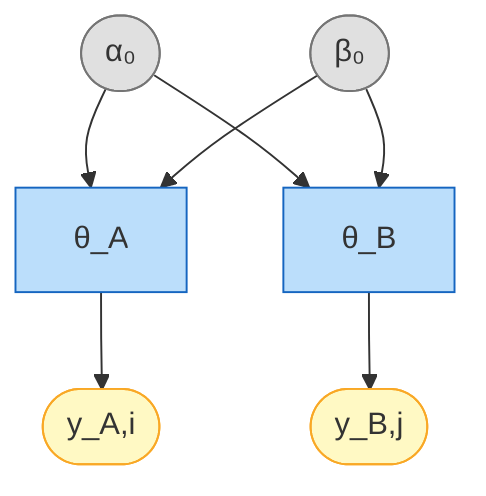

# Non-Paired Beta-Bernoulli Model

## Overview

The non-paired model compares two **independent** groups using a conjugate
Beta-Bernoulli model. Each group has its own success probability
$\theta_A$ and $\theta_B$, estimated independently from binarized
pass/fail data.

Use this model when group A and group B consist of **independent** observations
(i.e. different items or subjects in each group).

Input arrays can be **binary** (0/1) or **real-valued on (0, 1)** — continuous
scores are automatically binarized at a configurable threshold.

## Generative model

$$
\theta_A \sim \text{Beta}(\alpha_0, \beta_0) \qquad
\theta_B \sim \text{Beta}(\alpha_0, \beta_0)
\qquad (\text{independent draws})
$$

$$
y_{A,i} \sim \text{Bernoulli}(\theta_A), \quad i = 1, \dots, n_A \qquad
y_{B,j} \sim \text{Bernoulli}(\theta_B), \quad j = 1, \dots, n_B
$$

Here $\alpha_0$ and $\beta_0$ are **fixed** hyperparameters (user-specified
constants, not random variables). Although both groups share the same prior
family, $\theta_A$ and $\theta_B$ are drawn **independently**, so the two
groups are fully independent:

$$
p(y_A, y_B \mid \alpha_0, \beta_0)
= p(y_A \mid \alpha_0, \beta_0)\;p(y_B \mid \alpha_0, \beta_0)
$$

Dependence would only arise in a hierarchical model where $\alpha_0, \beta_0$
are themselves random with a shared hyperprior. In this model they are fixed
constants, so the DAG edges from $\alpha_0, \beta_0$ to both $\theta_A$ and
$\theta_B$ encode the same prior specification — not a probabilistic
dependence path.

The posterior is available in closed form via conjugacy:

$$
\theta_A \mid y_A \sim \text{Beta}(\alpha_0 + k_A,\; \beta_0 + n_A - k_A)
$$

where $k_A = \sum_{i} y_{A,i}$ is the number of successes (and analogously for group B).

### Directed Acyclic Graph (DAG)



<small>**Legend:** grey = hyperparameters, blue = latent parameters,
yellow = observed data.</small>

## Posterior probability of superiority

A key quantity of interest is the probability that group A has a higher
success rate than group B:

$$
P(\theta_A > \theta_B \mid y)
= \int_0^1 f_{\theta_A \mid y}(x)\;
  F_{\theta_B \mid y}(x)\;\mathrm{d}x
$$

where $f_{\theta_A \mid y}$ is the posterior **density** of $\theta_A$
and $F_{\theta_B \mid y}$ is the posterior **CDF** of $\theta_B$.

### Derivation

Because $\theta_A$ and $\theta_B$ are independent a posteriori:

$$
P(\theta_A > \theta_B \mid y)
= \int_0^1 \int_0^x
    f_{\theta_A \mid y}(x)\;f_{\theta_B \mid y}(t)
  \;\mathrm{d}t\;\mathrm{d}x
= \int_0^1 f_{\theta_A \mid y}(x)
  \underbrace{\int_0^x f_{\theta_B \mid y}(t)\;\mathrm{d}t}_{
    F_{\theta_B \mid y}(x)}\;\mathrm{d}x
$$

Substituting the conjugate posteriors
$\theta_A \mid y \sim \text{Beta}(a_A, b_A)$ and
$\theta_B \mid y \sim \text{Beta}(a_B, b_B)$:

$$
P(\theta_A > \theta_B \mid y)
= \int_0^1
    \frac{x^{a_A - 1}(1-x)^{b_A - 1}}{B(a_A, b_A)}
    \;I_x(a_B, b_B)
  \;\mathrm{d}x
$$

where $I_x(a, b) = B(a,b)^{-1}\int_0^x t^{a-1}(1-t)^{b-1}\,\mathrm{d}t$
is the **regularised incomplete Beta function**.

### Numerical evaluation

The integral is computed via **Gauss-Legendre quadrature** with $n_q$
nodes on $[0, 1]$. The Beta density is evaluated in log-space for
numerical stability:

$$
P(\theta_A > \theta_B \mid y)
\approx \sum_{j=1}^{n_q} w_j \;\exp\!\bigl[
  (a_A\!-\!1)\log x_j + (b_A\!-\!1)\log(1\!-\!x_j) - \log B(a_A, b_A)
\bigr]\;I_{x_j}(a_B, b_B)
$$

where $(x_j, w_j)$ are the transformed quadrature nodes and weights on
$[0, 1]$. This gives a **deterministic, exact** result (up to
floating-point precision) — no Monte Carlo noise. The implementation
is in `prob_greater` in `bayesprop.resources.bayes_nonpaired`.

## Difference posterior (exact convolution)

### Distribution of a difference of independent random variables

Let $X$ and $Y$ be independent continuous random variables with densities
$f_X$ and $f_Y$. The density of $Z = X - Y$ is the **convolution** of
$f_X$ with the reflection of $f_Y$:

$$
f_Z(z) = \int_{-\infty}^{\infty} f_X(x)\;f_Y(x - z)\;\mathrm{d}x
$$

This follows directly from the CDF:

$$
P(Z \leq z)
= P(X - Y \leq z)
= \int\!\!\int_{\{(x,y):\,x - y \leq z\}}
  f_X(x)\,f_Y(y)\;\mathrm{d}y\;\mathrm{d}x
$$

Substituting $y = x - z'$ and differentiating with respect to $z$ yields
the convolution integral above.

### Application to the Beta posteriors

In our model the two posteriors are independent:

$$
\theta_A \mid y_A \sim \text{Beta}(a_A,\, b_A), \qquad
\theta_B \mid y_B \sim \text{Beta}(a_B,\, b_B)
$$

with $a_A = \alpha_0 + k_A$, $b_A = \beta_0 + n_A - k_A$ (and
analogously for group B). Because both $\theta_A$ and $\theta_B$ have
support $[0, 1]$, the difference $\Delta = \theta_A - \theta_B$ has
support $(-1, 1)$, and the integration limits tighten to:

$$
f_{\Delta \mid y}(z)
= \int_{\max(0,\,z)}^{\min(1,\,1+z)}
    f_{\theta_A \mid y}(x) \;\cdot\; f_{\theta_B \mid y}(x - z)
  \;\mathrm{d}x
$$

The lower limit $\max(0, z)$ ensures $x \in [0,1]$; the upper limit
$\min(1, 1+z)$ ensures $x - z \in [0,1]$.

Substituting the Beta densities:

$$
f_{\Delta \mid y}(z)
= \frac{1}{B(a_A, b_A)\, B(a_B, b_B)}
  \int_{\max(0,\,z)}^{\min(1,\,1+z)}
    x^{a_A - 1}(1 - x)^{b_A - 1}
    (x - z)^{a_B - 1}(1 - x + z)^{b_B - 1}
  \;\mathrm{d}x
$$

where $B(a, b) = \Gamma(a)\Gamma(b)/\Gamma(a+b)$ is the Beta function.

### Closed form and numerical evaluation

Pham-Gia & Turkkan (1993) showed that the convolution integral admits a
**closed-form** expression in terms of **Appell's first hypergeometric
function** $F_1(a;\,b_1,b_2;\,c;\,x,y)$, split by the sign of $z$.
However, the $F_1$ arguments leave the double-series convergence region
near $z = 0$, requiring analytic continuation. In practice it is simpler
(and equally exact) to evaluate the convolution integral **directly** via
trapezoidal quadrature with the integrand computed in **log-space** for
numerical stability:

$$
\log f_{\Delta}(z)
= \log\!\int \exp\!\bigl[
    (a_A\!-\!1)\log x + (b_A\!-\!1)\log(1\!-\!x)
  + (a_B\!-\!1)\log(x\!-\!z) + (b_B\!-\!1)\log(1\!-\!x\!+\!z)
\bigr]\,\mathrm{d}x
\;-\; \log B(a_A, b_A) - \log B(a_B, b_B)
$$

This avoids underflow that would occur with direct multiplication of
many small values when the Beta parameters are large. The
implementation is in `beta_diff_pdf` in
`bayesprop.resources.bayes_nonpaired`.

!!! note "Reference"
    Pham-Gia, T. & Turkkan, N. (1993). Bayesian analysis of the
    difference of two proportions. *Communications in Statistics —
    Theory and Methods*, **22**(6), 1755–1771.

### Properties

- **Deterministic** — no random sampling, so repeated calls yield
  identical results.
- **Exact** — no KDE bandwidth selection or MC noise; the only
  approximation is floating-point quadrature error (negligible in
  practice).
- **Fast** — evaluating $f_\Delta(z)$ on a grid of 500 points takes
  a few milliseconds on modern hardware.

## Savage-Dickey Bayes Factor

The hypothesis test $H_0\!: \Delta = 0$ vs $H_1\!: \Delta \neq 0$ uses
the Savage-Dickey density ratio:

$$
BF_{01} = \frac{f_\Delta^{\text{post}}(0)}{f_\Delta^{\text{prior}}(0)}
\qquad\Longrightarrow\qquad
BF_{10} = \frac{1}{BF_{01}}
$$

Both densities are computed via exact convolution (no KDE needed), so the
Bayes factor is fully deterministic.

## Step-by-step example

### 1. Simulate data

```python
from bayesprop.utils.utils import simulate_nonpaired_scores
from bayesprop.resources.bayes_nonpaired import NonPairedBayesPropTest

sim = simulate_nonpaired_scores(N=150, theta_A=0.80, theta_B=0.75, seed=42)

print(f"True θ_A = {sim.theta_A:.2f},  θ_B = {sim.theta_B:.2f}")
print(f"True Δ   = {sim.theta_A - sim.theta_B:.2f}")
print(f"Observed rates: A = {sim.y_A.mean():.3f},  B = {sim.y_B.mean():.3f}")
```

```text
True θ_A = 0.80,  θ_B = 0.75
True Δ   = 0.05
Observed rates: A = 0.860,  B = 0.720
```

### 2. Fit the model

```python
model = NonPairedBayesPropTest(
    alpha0=1.0,      # Beta(1,1) = uniform prior
    beta0=1.0,
    seed=42,
    n_samples=50_000,
).fit(sim.y_A, sim.y_B)

s = model.summary
print(f"Mean Δ (θ_A − θ_B) = {s.mean_delta:+.4f}")
print(f"95% CI = [{s.ci_95.lower:.4f}, {s.ci_95.upper:.4f}]")
print(f"P(A > B) = {s.p_A_greater_B:.4f}")
```

```text
Mean Δ (θ_A − θ_B) = +0.1381
95% CI = [0.0469, 0.2288]
P(A > B) = 0.9981
```

!!! note "Two estimators for `P(A > B)`"
    `summary.p_A_greater_B` uses Monte Carlo on the joint posterior
    samples, while `model.prob_greater()` uses Gauss–Legendre
    quadrature against the analytic Beta posteriors. Both estimate
    the same probability and agree to MC error
    ($\sim 1/\sqrt{n_\text{samples}}$); they will not, however, sum
    to exactly 1 with `prob_greater(reverse=True)` because they come
    from different estimators.

### 3. Unified decision (BF + P(H₀) + ROPE)

```python
d = model.decide()

print(f"Bayes Factor:  BF₁₀ = {d.bayes_factor.BF_10:.2f}  → {d.bayes_factor.decision}")
print(f"Posterior Null: P(H₀|D) = {d.posterior_null.p_H0:.4f}  → {d.posterior_null.decision}")
print(f"ROPE:          {d.rope.decision}  ({d.rope.pct_in_rope:.1%} in ROPE)")
```

```text
Bayes Factor:  BF₁₀ = 9.91  → Reject H0
Posterior Null: P(H₀|D) = 0.0917  → Undecided
ROPE:          Reject H0 — A practically better  (0.6% in ROPE)
```

$BF_{10}=9.91$ sits at the upper edge of "moderate" on Jeffreys' scale
($BF_{10}=10$ is the boundary to "strong"); a longer MC run
(`n_samples=100_000`) can nudge it across.

### 4. Plot posteriors

```python
model.plot_posteriors(title="Beta-Bernoulli Posteriors")
```


### 5. Savage-Dickey plot

```python
model.plot_savage_dickey(title="Savage-Dickey (exact convolution)")
```


### 6. Posterior predictive checks

```python
ppc = model.ppc_pvalues(seed=42)

print(f"{'Statistic':<25} {'Observed':>10} {'p-value':>10} {'Status':>8}")
print("-" * 55)
for stat, vals in ppc.items():
    print(f"{stat:<25} {vals.observed:>10.4f} {vals.p_value:>10.3f} {vals.status:>8}")
```

```text
Statistic                   Observed    p-value   Status
-------------------------------------------------------
mean(y_A)                     0.8600      0.953       OK
mean(y_B)                     0.7200      0.974       OK
mean(y_A)-mean(y_B)           0.1400      0.979       OK
```

A p-value $< 0.05$ flags that the observed statistic is extreme under
the fitted model (potential misfit); $> 0.05$ means the model
reproduces that aspect of the data adequately. The two-sided p-value
uses the **mid-p** convention (ties at $T^{\text{rep}}=T^{\text{obs}}$
are split evenly between the two tails) so it does not clip at 1.0
on discrete data.

!!! warning "Saturated model — interpret with care"
    For the conjugate Beta-Bernoulli model the sample mean is a
    **sufficient statistic** for each group, so PPC checks based on
    the means (and any deterministic function of them, including the
    sample variance for binary data) are guaranteed to be close to
    the centre of the replicated distribution. P-values near 1.0 are
    therefore expected here and *do not* constitute a strong test of
    fit — they only catch gross misspecification (e.g. wrong
    likelihood family). Meaningful PPC requires either covariates or
    a hierarchical structure that the sample mean does not summarise.

## Prior sensitivity analysis

Test how results change with different priors to check robustness:

```python
priors = [
    ("Uniform Beta(1,1)",      1.0, 1.0),
    ("Jeffreys Beta(0.5,0.5)", 0.5, 0.5),
    ("Informative Beta(2,2)",  2.0, 2.0),
    ("Strong Beta(5,5)",       5.0, 5.0),
]

print(f"{'Prior':<28} {'BF₁₀':>8} {'BF Decision':<20} {'ROPE Decision':<20}")
print("=" * 80)

for name, a0, b0 in priors:
    m = NonPairedBayesPropTest(alpha0=a0, beta0=b0, seed=42, n_samples=50_000).fit(y_A, y_B)
    d_i = m.decide()
    print(f"{name:<28} {d_i.bayes_factor.BF_10:>8.2f} "
          f"{d_i.bayes_factor.decision:<20} {d_i.rope.decision:<20}")
```

If the conclusion is stable across priors, you can be confident the result is
not an artifact of the prior choice.

## Posterior concentration with increasing n

As the sample size grows, the posterior of $\Delta$ concentrates around the
true effect size. This plot shows how precision improves:

```python
import numpy as np
import matplotlib.pyplot as plt
from bayesprop.resources.bayes_nonpaired import beta_diff_pdf

z_grid = np.linspace(-0.6, 0.8, 400)
fig, ax = plt.subplots(figsize=(9, 5))

for n, col in zip([10, 30, 100, 500], ["#E91E63", "#FF9800", "#4CAF50", "#2196F3"]):
    a_A = 1 + int(0.78 * n)
    b_A = 1 + n - int(0.78 * n)
    a_B = 1 + int(0.55 * n)
    b_B = 1 + n - int(0.55 * n)
    density = np.array([beta_diff_pdf(z, a_A, b_A, a_B, b_B) for z in z_grid])
    ax.plot(z_grid, density, color=col, linewidth=2, label=f"n = {n}")

ax.axvline(0.23, color="red", linestyle=":", linewidth=1.5, alpha=0.7, label="True Δ = 0.23")
ax.axvline(0, color="gray", linestyle="--", linewidth=1, alpha=0.5)
ax.set_xlabel("Δ = θ_A − θ_B")
ax.set_ylabel("Density")
ax.set_title("Posterior Concentration with Increasing n")
ax.legend(fontsize=9)
ax.grid(alpha=0.3)
plt.tight_layout()
plt.show()
```


## Null scenario (equal rates)

Under the null ($\theta_A = \theta_B$), the model should correctly find
$BF_{01} > 1$ (evidence *for* $H_0$):

```python
rng_null = np.random.default_rng(99)
y_A_null = rng_null.binomial(1, 0.65, size=150).astype(float)
y_B_null = rng_null.binomial(1, 0.65, size=150).astype(float)

model_null = NonPairedBayesPropTest(seed=99, n_samples=50_000).fit(y_A_null, y_B_null)
model_null.print_summary()
model_null.plot_savage_dickey(title="Savage-Dickey — Null Scenario (equal rates)")
```


## BFDA sample-size planning

Use Bayes Factor Design Analysis to determine how many observations you need
for a given effect size. See the [BFDA guide](bfda.md) for details.

```python
from bayesprop.utils.utils import bfda_power_curve, plot_bfda_power

theta_A_hat = y_A.mean()
theta_B_hat = y_B.mean()

sample_sizes = [20, 30, 50, 75, 100, 150, 200, 300, 500]

power_curve = bfda_power_curve(
    theta_A_true=theta_A_hat,
    theta_B_true=theta_B_hat,
    sample_sizes=sample_sizes,
    design="nonpaired",
    decision_rule="bayes_factor",
    bf_threshold=3.0,
    n_sim=1000,
    seed=42,
)

plot_bfda_power(power_curve, theta_A_hat, theta_B_hat)
```


## Sequential design and decision making

In a **sequential** A/B test the data arrive in batches over time and we
update the posterior after each look. Because the Beta–Bernoulli model is
conjugate, the running posterior

$$
\theta_A \mid \text{data}^{(t)} \sim \text{Beta}(\alpha_A^{(t)}, \beta_A^{(t)}),
\qquad
\theta_B \mid \text{data}^{(t)} \sim \text{Beta}(\alpha_B^{(t)}, \beta_B^{(t)})
$$

acts as the prior for the next batch. Four sufficient statistics per arm
therefore carry **all** the information needed to recompute the
Savage–Dickey Bayes factor on $\Delta = \theta_A - \theta_B$, the posterior
probability $P(\theta_B > \theta_A)$, and a ROPE decision at every look.

### Stopping rule

At each look $t$ the test evaluates the running $\text{BF}_{10}^{(t)}$ and
stops as soon as one of the following holds:

- $\text{BF}_{10}^{(t)} \ge B_U$ (`bf_upper`) → stop for $H_1$ (evidence of a difference).
- $\text{BF}_{10}^{(t)} \le B_L$ (`bf_lower`) → stop for $H_0$ (evidence of practical equivalence).
- $\min(n_A^{(t)}, n_B^{(t)}) \ge n_{\max}$ → stop because the budget is exhausted.

A minimum sample size $n_{\min}$ per arm (`n_min`) is enforced before any BF-based
stop is allowed, which avoids unstable early Bayes factors. Because the
posterior is exact and conjugate, performing many looks does **not** inflate
a frequentist Type-I rate the way repeated $p$-values would: the BF is a
coherent likelihood ratio whose interpretation is invariant to the stopping
rule (optional stopping is permitted).

### Example: streaming Bernoulli batches

Ground truth $\theta_A = 0.75$, $\theta_B = 0.55$ ($\Delta = 0.20$ in favour
of A). Each look delivers a batch of 25 Bernoulli observations per arm.

```python
import numpy as np
from bayesprop.resources.bayes_nonpaired import SequentialNonPairedBayesPropTest

rng = np.random.default_rng(42)
theta_A_true, theta_B_true = 0.75, 0.55
batch_size = 25
n_batches_max = 40

def stream():
    """Yield (y_a_batch, y_b_batch) pairs of binary observations."""
    for _ in range(n_batches_max):
        y_a = rng.binomial(1, theta_A_true, size=batch_size).astype(float)
        y_b = rng.binomial(1, theta_B_true, size=batch_size).astype(float)
        yield y_a, y_b

seq = SequentialNonPairedBayesPropTest(
    alpha0=1.0,
    beta0=1.0,
    bf_upper=10.0,
    bf_lower=0.1,
    n_min=30,
    n_max=1000,
    rope_epsilon=0.02,
    seed=0,
    n_samples=10_000,
    verbose=True,
)

final = seq.run(stream())

print("Stopped:", seq.stopped)
print("Reason :", seq.stop_reason)
print("Looks  :", len(seq.history))
print("Final n per arm:", final.n_A, final.n_B)
```

Typical output:

```text
[look 1] n_A=25  n_B=25  P(B>A)=0.800 BF10=0.478 stop=False
[look 2] n_A=50  n_B=50  P(B>A)=0.338 BF10=0.254 stop=False
[look 3] n_A=75  n_B=75  P(B>A)=0.244 BF10=0.240 stop=False
[look 4] n_A=100 n_B=100 P(B>A)=0.118 BF10=0.336 stop=False
[look 5] n_A=125 n_B=125 P(B>A)=0.017 BF10=1.43  stop=False
[look 6] n_A=150 n_B=150 P(B>A)=0.003 BF10=6.99  stop=False
[look 7] n_A=175 n_B=175 P(B>A)=0.000 BF10=187   stop=True   (BF10 ≥ 10.0)

Stopped: True
Reason : BF10 ≥ 10.0 (evidence for H1)
Looks  : 7
Final n per arm: 175 175
```

### Inspect the final snapshot and history

The last `SequentialLookResult` exposes the same diagnostics as the batch
test (posterior state, $P(\theta_B > \theta_A)$, Savage–Dickey BF, ROPE),
and `history_frame()` returns one row per look:

```python
ps = final.posterior_state
print(f"theta_A | data ~ Beta({ps.alpha_A:.0f}, {ps.beta_A:.0f})")
print(f"theta_B | data ~ Beta({ps.alpha_B:.0f}, {ps.beta_B:.0f})")
print(f"P(theta_B > theta_A) = {final.P_B_greater_A:.4f}")
print(f"BF10 = {final.decision.bayes_factor.BF_10:.3g}")
print(f"ROPE decision: {final.decision.rope.decision}")

df = seq.history_frame()       # per-look DataFrame
seq.plot_trajectory()           # BF10 and P(B>A) vs cumulative n
```

### Equivalence to a single-shot fit

Because of conjugacy, fitting all accumulated data in one shot must yield
**exactly** the same posterior as the sequential update — a useful sanity
check:

```python
from bayesprop.resources.bayes_nonpaired import NonPairedBayesPropTest

y_a_all = np.r_[np.ones(final.successes_A), np.zeros(final.n_A - final.successes_A)]
y_b_all = np.r_[np.ones(final.successes_B), np.zeros(final.n_B - final.successes_B)]

bb_batch = NonPairedBayesPropTest(alpha0=1.0, beta0=1.0, seed=0, n_samples=10_000).fit(
    y_a_all, y_b_all
)
# bb_batch.a_A, bb_batch.b_A, ... match seq.posterior_state exactly.
```

See the runnable notebook at
`src/notebooks/sequential_nonpaired_demo.ipynb` for the full demo.

## API

See [API Reference — Non-Paired Model](../api/bayes_nonpaired.md) for full method documentation.
