# Paired Model — Laplace Approximation

## Overview

The paired model is used when **both** conditions are evaluated on the **same**
items or subjects. It uses a pooled Bernoulli logistic regression with a Laplace
approximation (MAP + analytical Hessian) for fast, analytic posterior inference.

## Generative model

$$
\mu \sim \mathcal{N}(0, \sigma_\mu) \qquad
\delta_A \sim \mathcal{N}(0, \sigma_\delta)
$$

$$
y_{A,i} \sim \text{Bernoulli}\bigl(\sigma(\mu + \delta_A)\bigr) \qquad
y_{B,i} \sim \text{Bernoulli}\bigl(\sigma(\mu)\bigr)
$$

where $\sigma(x) = 1/(1 + e^{-x})$ is the logistic sigmoid function.
The parameter $\delta_A$ captures group A's advantage on the logit scale;
$\mu$ is the shared baseline log-odds.

### Directed Acyclic Graph (DAG)

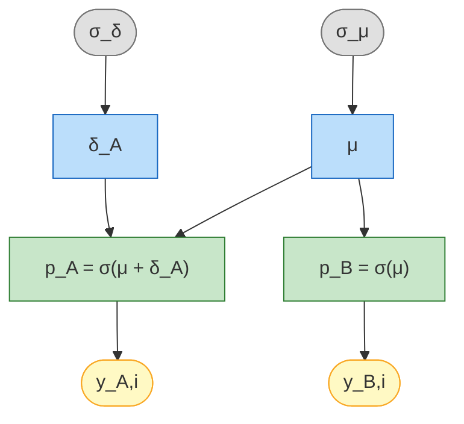

<small>**Legend:** grey = hyperparameters, blue = latent parameters, green = deterministic,
yellow = observed data.</small>

## Laplace approximation

The Laplace method approximates the posterior as a bivariate Gaussian centred
at the MAP (maximum a posteriori) estimate:

$$
p(\mu, \delta_A \mid y) \;\approx\; \mathcal{N}\!\bigl(\hat{\theta}_{\text{MAP}},\; \mathbf{H}^{-1}\bigr)
$$

where $\mathbf{H}$ is the Hessian of the negative log-posterior evaluated at the MAP.

### Log-posterior

$$
\log p(\mu, \delta \mid y) = \sum_i \bigl[y_{A,i} \log p_A + (1 - y_{A,i}) \log(1 - p_A)\bigr]
+ \sum_i \bigl[y_{B,i} \log p_B + (1 - y_{B,i}) \log(1 - p_B)\bigr]
- \frac{\mu^2}{2\sigma_\mu^2} - \frac{\delta^2}{2\sigma_\delta^2}
$$

with $p_A = \sigma(\mu + \delta_A)$ and $p_B = \sigma(\mu)$.

### Gradient

$$
\frac{\partial}{\partial \mu} = (k_A - n \cdot p_A) + (k_B - n \cdot p_B) - \frac{\mu}{\sigma_\mu^2}
$$

$$
\frac{\partial}{\partial \delta_A} = (k_A - n \cdot p_A) - \frac{\delta_A}{\sigma_\delta^2}
$$

where $k_A = \sum y_{A,i}$ and $k_B = \sum y_{B,i}$.

### Hessian of negative log-posterior

$$
H_{00} = n \cdot w_A + n \cdot w_B + \frac{1}{\sigma_\mu^2}, \qquad
H_{11} = n \cdot w_A + \frac{1}{\sigma_\delta^2}, \qquad
H_{01} = H_{10} = n \cdot w_A
$$

where $w_A = p_A(1 - p_A)$ and $w_B = p_B(1 - p_B)$, evaluated at the MAP.

## When to use

- **Fast inference** — no MCMC, results in milliseconds
- **Moderate sample sizes** — works well with $n \geq 30$
- **Exploratory analysis** — quick iteration before committing to full MCMC

For exact posterior inference with convergence diagnostics, see
[Paired Model (Pólya-Gamma)](paired_pg.md).

## Step-by-step example

### 1. Simulate paired data

```python
from bayesprop.resources.bayes_paired_laplace import PairedBayesPropTest
from bayesprop.utils.utils import simulate_paired_scores

sim = simulate_paired_scores(N=150, delta_A=0.8, sigma_theta=0.0, seed=42)

print(f"True δ_A = {sim.true_params.delta_A}")
print(f"Observed rates: A = {sim.y_A.mean():.3f},  B = {sim.y_B.mean():.3f}")
```

### 2. Fit the model

```python
model = PairedBayesPropTest(
    prior_sigma_delta=1.0,
    seed=42,
    n_samples=50_000,
).fit(sim.y_A, sim.y_B)

s = model.summary
print(f"δ_A posterior mean = {s.delta_A_posterior_mean:+.4f}")
print(f"Mean Δ (prob)  = {s.mean_delta:+.4f}")
print(f"95% CI         = [{s.ci_95.lower:.4f}, {s.ci_95.upper:.4f}]")
print(f"P(A>B)         = {s.p_A_greater_B:.4f}")
```

### 3. Unified decision

```python
d = model.decide()

print(f"Bayes Factor:  BF₁₀ = {d.bayes_factor.BF_10:.2f}  → {d.bayes_factor.decision}")
print(f"Posterior Null: P(H₀|D) = {d.posterior_null.p_H0:.4f}  → {d.posterior_null.decision}")
print(f"ROPE:          {d.rope.decision}  ({d.rope.pct_in_rope:.1%} in ROPE)")
```

### 4. Laplace posterior visualisation

The Laplace approximation produces a bivariate Gaussian in $(\mu, \delta_A)$.
You can inspect the marginals:

```python
import numpy as np
import matplotlib.pyplot as plt
from scipy.stats import norm

laplace = model.laplace
mu_map, delta_map = laplace['map']
cov = laplace['cov']

fig, axes = plt.subplots(1, 2, figsize=(14, 4))

# δ_A marginal
ax = axes[0]
delta_s = laplace['delta_A_samples']
ax.hist(delta_s, bins=60, density=True, alpha=0.6, color='#2196F3', edgecolor='white')
x = np.linspace(delta_s.min() - 0.3, delta_s.max() + 0.3, 300)
sd_d = np.sqrt(cov[1, 1])
ax.plot(x, norm.pdf(x, delta_map, sd_d), 'r-', lw=2,
        label=f'N({delta_map:.3f}, {sd_d:.3f}²)')
ax.axvline(0, color='gray', ls='--', alpha=0.5)
ax.set_xlabel('δ_A (logit scale)')
ax.set_title('δ_A posterior', fontweight='bold')
ax.legend(fontsize=8)
ax.grid(alpha=0.3)

# μ marginal
ax = axes[1]
mu_s = laplace['mu_samples']
ax.hist(mu_s, bins=60, density=True, alpha=0.6, color='#4CAF50', edgecolor='white')
x_mu = np.linspace(mu_s.min() - 0.3, mu_s.max() + 0.3, 300)
sd_m = np.sqrt(cov[0, 0])
ax.plot(x_mu, norm.pdf(x_mu, mu_map, sd_m), 'r-', lw=2,
        label=f'N({mu_map:.3f}, {sd_m:.3f}²)')
ax.set_xlabel('μ (logit scale)')
ax.set_title('μ posterior', fontweight='bold')
ax.legend(fontsize=8)
ax.grid(alpha=0.3)

plt.tight_layout()
plt.show()

print(f"MAP: μ={mu_map:.4f}, δ_A={delta_map:.4f}")
print(f"Posterior sd: μ={sd_m:.4f}, δ_A={sd_d:.4f}")
print(f"Correlation: {cov[0,1]/np.sqrt(cov[0,0]*cov[1,1]):.3f}")
```

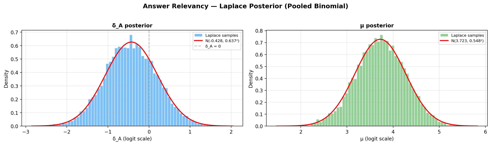

Or use the built-in method:

```python
model.plot_laplace_posterior()
```

### 5. Posterior of $\Delta$ on the probability scale

```python
model.plot_posterior_delta()
```

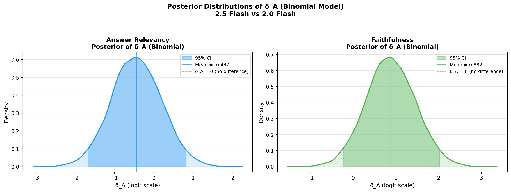

### 6. Savage-Dickey Bayes Factor plot

```python
model.plot_savage_dickey()
```

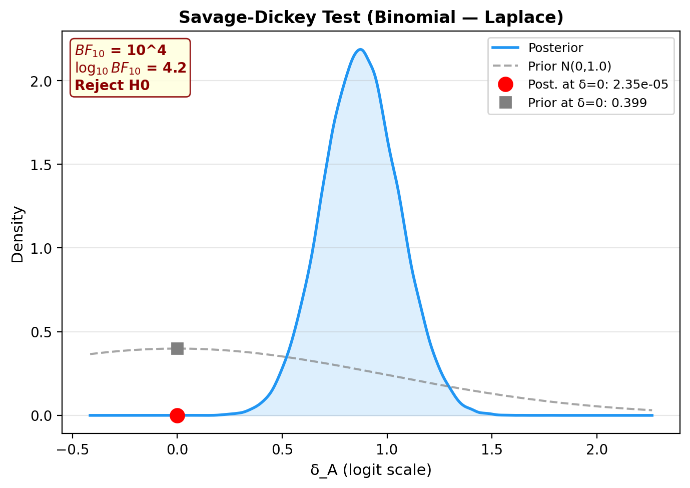

### 7. Posterior predictive checks

```python
ppc = model.ppc_pvalues(seed=42)

print(f"{'Statistic':<20} {'Observed':>10} {'p-value':>10} {'Status':>10}")
print("-" * 55)
for stat_name, vals in ppc.items():
    print(f"{stat_name:<20} {vals.observed:>10.4f} {vals.p_value:>10.3f} {vals.status:>10}")
```

PPC plots (fraction perfect for each model + rate difference):

```python
model.plot_ppc(seed=42)
```

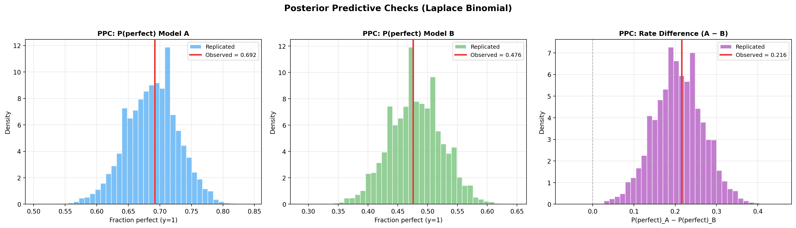

## Multi-metric comparison

When you have multiple paired metrics, fit a model per metric and compare:

```python
import numpy as np

comparison_results = {}

for metric in metric_names:
    m = cached['metrics'][metric]
    s_A = np.array(m['s_A_raw'])
    s_B = np.array(m['s_B_raw'])

    n = min(len(s_A), len(s_B))
    y_A = (s_A[:n] >= 0.7).astype(int)
    y_B = (s_B[:n] >= 0.7).astype(int)

    model = PairedBayesPropTest(seed=42).fit(y_A, y_B)
    comparison_results[metric] = model

    s = model.summary
    print(f"{metric:<22} Δ={s.mean_delta:+.4f}  "
          f"P(A>B)={s.p_A_greater_B:.4f}  "
          f"BF₁₀={model.decide().bayes_factor.BF_10:.2f}")
```

### Forest plot

```python
PairedBayesPropTest.plot_forest(
    comparison_results,
    label_A="Group A",
    label_B="Group B",
)
```

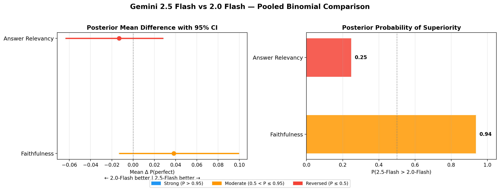

### Comparison table

```python
PairedBayesPropTest.print_comparison_table(comparison_results)
```

## Prior sensitivity analysis

### Sensitivity to prior $P(H_0)$

Plot how the posterior $P(H_0 \mid D)$ changes as you vary the prior
$\pi_0 = P(H_0)$:

```python
model.plot_sensitivity(prior_H0=0.5)
```

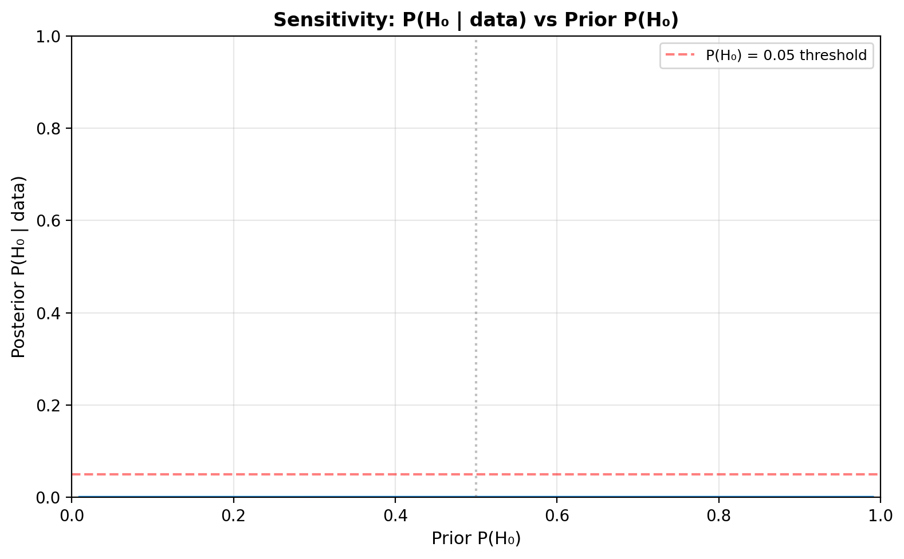

### Sensitivity to slab width $\sigma_s$

The Savage-Dickey BF depends on the prior at $\delta_A = 0$. For a
$\mathcal{N}(0, \sigma_s)$ slab prior, a wider slab concentrates less
density at zero, inflating $BF_{10}$. This is the Jeffreys-Lindley
paradox in action:

```python
import numpy as np
import matplotlib.pyplot as plt
from scipy.stats import gaussian_kde, norm

sigma_grid = np.linspace(0.25, 5.0, 100)
samples = model.delta_A_samples
kde = gaussian_kde(samples)
post_at_0 = float(kde(0.0)[0])

bf10_vals = [norm.pdf(0, 0, s) / post_at_0 for s in sigma_grid]

fig, ax = plt.subplots(figsize=(8, 5))
ax.plot(sigma_grid, bf10_vals, linewidth=2)
ax.axhline(3, color='red', linestyle='--', alpha=0.5, label='BF₁₀ = 3')
ax.axhline(1, color='gray', linestyle=':', alpha=0.5, label='BF₁₀ = 1')
ax.axvline(1.0, color='gray', linestyle='--', alpha=0.3, label='σ_s = 1 (default)')
ax.set_xlabel('Slab width σ_s')
ax.set_ylabel('BF₁₀')
ax.set_title('Sensitivity: BF₁₀ vs Slab Width')
ax.set_yscale('log')
ax.legend(fontsize=9)
ax.grid(alpha=0.3)
plt.tight_layout()
plt.show()
```

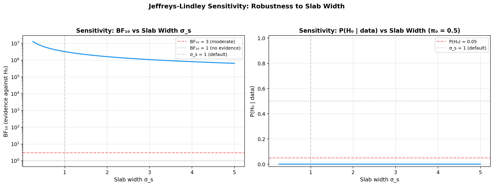

## Frequentist comparison (McNemar test)

For reference, you can compare the Bayesian result with McNemar's test on
the same binarized paired data:

```python
from scipy.stats import chi2
import math

y_A = model.y_A_obs
y_B = model.y_B_obs

b = np.sum((y_A == 1) & (y_B == 0))  # A perfect, B not
c = np.sum((y_A == 0) & (y_B == 1))  # B perfect, A not

if b + c > 0:
    chi2_stat = (b - c) ** 2 / (b + c)
    p_val = 1 - chi2.cdf(chi2_stat, df=1)
    print(f"Discordant pairs: A>B={b}, B>A={c}")
    print(f"McNemar χ² = {chi2_stat:.2f}, p = {p_val:.4f}")
```

## BFDA sample-size planning

```python
from bayesprop.utils.utils import bfda_power_curve, plot_bfda_power

theta_A_hat = model.y_A_obs.mean()
theta_B_hat = model.y_B_obs.mean()
sample_sizes = [20, 30, 50, 75, 100, 150, 200, 300, 500]

power_curve = bfda_power_curve(
    theta_A_true=theta_A_hat,
    theta_B_true=theta_B_hat,
    sample_sizes=sample_sizes,
    design="paired",
    decision_rule="bayes_factor",
    bf_threshold=3.0,
    n_sim=200,
    seed=42,
)

plot_bfda_power(
    power_curve, theta_A_hat, theta_B_hat,
    title=f"BFDA Power Curve (Paired Laplace) — Δ = {theta_A_hat - theta_B_hat:.3f}"
)
```

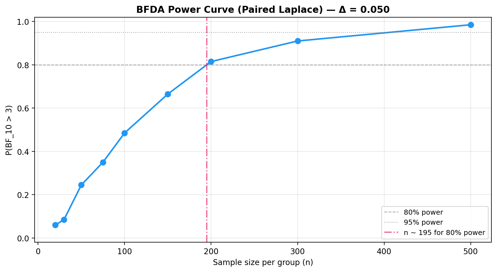

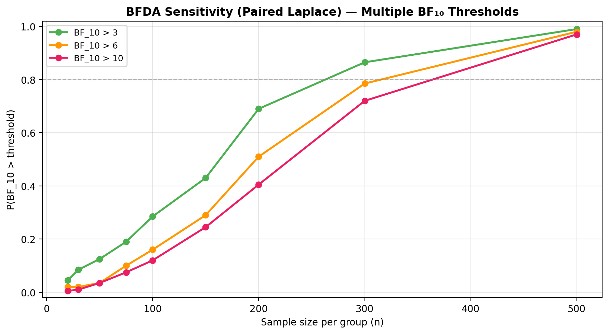

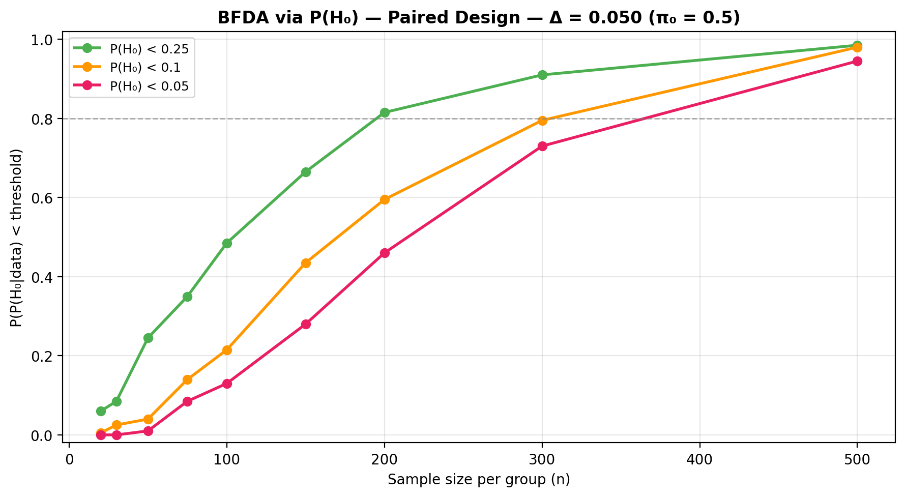

See the [BFDA guide](bfda.md) for sensitivity analysis and $P(H_0)$-based
power curves.

## API

See [API Reference — Paired Model (Laplace)](../api/bayes_paired_laplace.md) for full method documentation.
