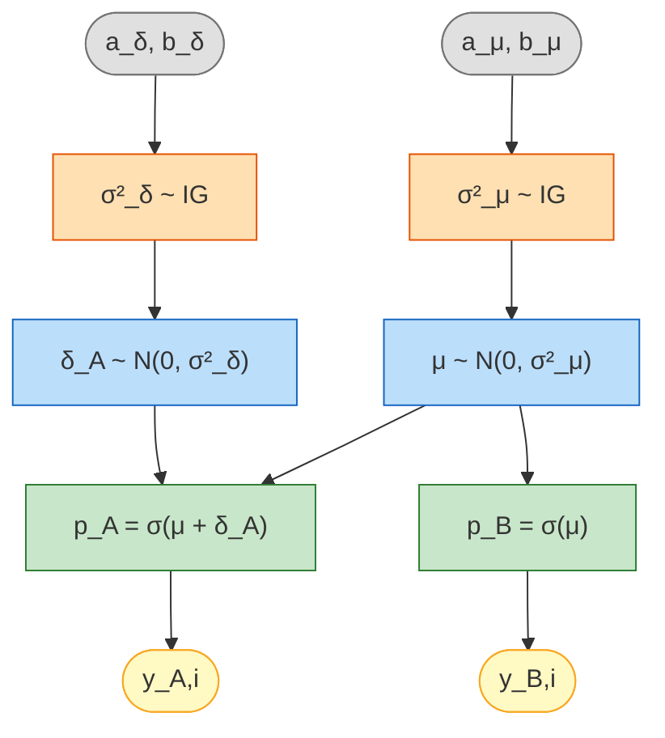
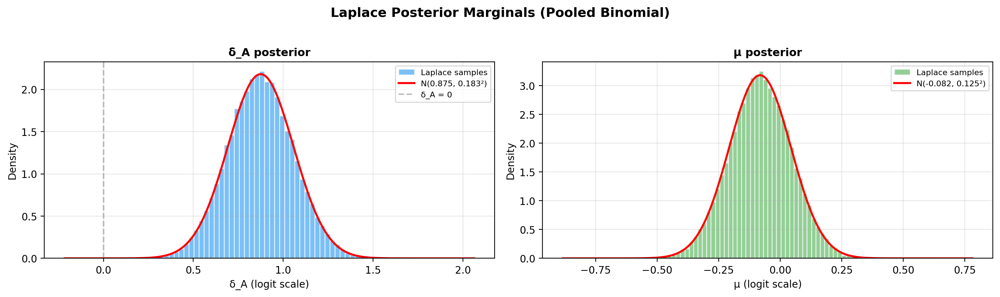

# Paired Model — Laplace Approximation

## Overview

The paired model is used when **both** conditions are evaluated on the **same**
items or subjects. It uses a Bernoulli logistic regression with a Laplace
approximation (MAP + analytical Hessian) for fast, analytic posterior inference.

Two modes are supported:

- **Fixed priors (default)** — the prior scales $\sigma_\mu$ and $\sigma_\delta$
  are user-chosen constants. The MAP is found by a 2-D Newton solver.
- **Hierarchical (learned scales)** — Inverse-Gamma hyperpriors are placed on
  $\sigma_\mu^2$ and $\sigma_\delta^2$, so the prior widths are learned from
  data via a 4-D Newton solver. This makes the Savage–Dickey Bayes factor
  robust to the Jeffreys–Lindley paradox.

## Generative model

### Fixed priors (default)

$$
\mu \sim \mathcal{N}(0, \sigma_\mu) \qquad
\delta_A \sim \mathcal{N}(0, \sigma_\delta)
$$

$$
y_{A,i} \sim \text{Bernoulli}\bigl(\sigma(\mu + \delta_A)\bigr) \qquad
y_{B,i} \sim \text{Bernoulli}\bigl(\sigma(\mu)\bigr)
$$

where $\sigma(x) = 1/(1 + e^{-x})$ is the logistic sigmoid function.
The parameter $\delta_A$ captures group A's advantage on the logit scale;
$\mu$ is the shared baseline log-odds.

#### DAG (fixed priors)


<small>**Legend:** grey = fixed hyperparameters, blue = latent parameters, green = deterministic,
yellow = observed data.</small>

### Hierarchical logistic regression (learned scales)

When `hyperprior_mu` and `hyperprior_delta` are set, the model becomes a
hierarchical logistic regression where the prior variances are themselves
random variables:

$$
\sigma_\mu^2   \sim \mathrm{Inv\text{-}Gamma}(a_\mu,\, b_\mu)
\qquad
\sigma_\delta^2 \sim \mathrm{Inv\text{-}Gamma}(a_\delta,\, b_\delta)
$$

$$
\mu \sim \mathcal{N}(0,\, \sigma_\mu^2)
\qquad
\delta_A \sim \mathcal{N}(0,\, \sigma_\delta^2)
$$

$$
y_{A,i} \sim \text{Bernoulli}\bigl(\sigma(\mu + \delta_A)\bigr)
\qquad
y_{B,i} \sim \text{Bernoulli}\bigl(\sigma(\mu)\bigr)
$$

#### DAG (hierarchical)



<small>**Legend:** grey = fixed hyperparameters, orange = learned hyperparameters,
blue = latent parameters, green = deterministic, yellow = observed data.</small>

## Laplace approximation

The Laplace method approximates the posterior as a multivariate Gaussian centred
at the MAP (maximum a posteriori) estimate:

$$
p(\boldsymbol{\theta} \mid y) \;\approx\; \mathcal{N}\!\bigl(\hat{\boldsymbol{\theta}}_{\text{MAP}},\; \mathbf{H}^{-1}\bigr)
$$

where $\mathbf{H}$ is the Hessian of the negative log-posterior evaluated at the MAP.

### Fixed-prior case (2-D)

#### Log-posterior

Let $\boldsymbol{\theta} = (\mu, \delta_A)^\top$ denote the parameter vector. The log-posterior is

$$
\log p(\boldsymbol{\theta} \mid y) = \sum_i \bigl[y_{A,i} \log p_A + (1 - y_{A,i}) \log(1 - p_A)\bigr]
+ \sum_i \bigl[y_{B,i} \log p_B + (1 - y_{B,i}) \log(1 - p_B)\bigr]
- \frac{\mu^2}{2\sigma_\mu^2} - \frac{\delta_A^2}{2\sigma_\delta^2}
$$

with $p_A = \sigma(\mu + \delta_A)$ and $p_B = \sigma(\mu)$.

#### Gradient

$$
\frac{\partial \log p(\boldsymbol{\theta} \mid y)}{\partial \mu} = (k_A - n_A \cdot p_A) + (k_B - n_B \cdot p_B) - \frac{\mu}{\sigma_\mu^2}
$$

$$
\frac{\partial \log p(\boldsymbol{\theta} \mid y)}{\partial \delta_A} = (k_A - n_A \cdot p_A) - \frac{\delta_A}{\sigma_\delta^2}
$$

where $k_A = \sum y_{A,i}$ and $k_B = \sum y_{B,i}$.

#### Hessian of negative log-posterior

$$
H_{00} = n_A w_A + n_B w_B + \frac{1}{\sigma_\mu^2}, \qquad
H_{11} = n_A w_A + \frac{1}{\sigma_\delta^2}, \qquad
H_{01} = H_{10} = n_A w_A
$$

where $w_A = p_A(1 - p_A)$ and $w_B = p_B(1 - p_B)$, evaluated at the MAP.

#### Solver

The MAP is found by **damped Newton iteration** in 2-D using the closed-form
gradient and Hessian above (no external optimizer is invoked).
Unlike gradient descent, which only uses the gradient, Newton's method also
uses the **Hessian** (second-derivative curvature) to compute the optimal
step direction and size:

$$
\boldsymbol{\theta}_{t+1} = \boldsymbol{\theta}_t - \mathbf{H}^{-1}\,\nabla f
$$

This solves the linear system
$\mathbf{H}\,\Delta\boldsymbol{\theta} = -\nabla f$ for the Newton step
$\Delta\boldsymbol{\theta}$. Because it accounts for curvature, Newton
converges **quadratically** (the error squares each iteration) near the
optimum, while gradient descent only converges linearly.

In the 2-D case the $2\times 2$ system is solved in closed form via the
cofactor inverse, and an Armijo backtracking line search guarantees monotone
descent even from a poor starting point.

Because the negative log-posterior is strictly convex (Gaussian priors plus
Bernoulli likelihood), convergence is guaranteed. The
`SequentialPairedBayesPropTest` warm-starts each look from the
previous MAP, which typically requires only **1–3 iterations** per update.
A warning is emitted if `max_iter` is reached without convergence.

### Hierarchical case (4-D)

When Inverse-Gamma hyperpriors are placed on $\sigma_\mu^2$ and $\sigma_\delta^2$,
the optimisation is lifted to a 4-D reparameterised space.

#### Reparameterisation

To enforce positivity of $\sigma_\mu$ and $\sigma_\delta$ we optimise in the
log-scale parameterisation $\psi_\mu = \log \sigma_\mu$ and
$\psi_\delta = \log \sigma_\delta$.
The Jacobian of the transform is absorbed into the log-posterior, giving the
4-D parameter vector $\boldsymbol{\phi} = (\mu,\, \delta_A,\, \psi_\mu,\, \psi_\delta)^\top$.

#### 4-D negative log-posterior

Using the precision $\tau = e^{-2\psi}$ (since $\psi = \log\sigma$ implies
$\sigma^2 = e^{2\psi}$, so $\tau = 1/\sigma^2 = e^{-2\psi}$) and writing
the Inverse-Gamma log-density on the $\psi$-scale:

$$
-\log p(\boldsymbol{\phi} \mid y) \;=\;
\underbrace{
  k_A \log(1 + e^{-z_A}) + (n_A - k_A)\log(1 + e^{z_A})
  + k_B \log(1 + e^{-z_B}) + (n_B - k_B)\log(1 + e^{z_B})
}_{\text{neg log-likelihood}}
$$

$$
\;+\;
\underbrace{
  (2a_\mu + 1)\,\psi_\mu + \bigl(\tfrac{\mu^2}{2} + b_\mu\bigr)\,\tau_\mu
  + (2a_\delta + 1)\,\psi_\delta + \bigl(\tfrac{\delta_A^2}{2} + b_\delta\bigr)\,\tau_\delta
}_{\text{neg log-prior (IG + Gaussian + Jacobian)}}
$$

where $z_A = \mu + \delta_A$, $z_B = \mu$, $\tau_\mu = e^{-2\psi_\mu}$,
$\tau_\delta = e^{-2\psi_\delta}$.

#### 4-D gradient

$$
\nabla_\mu = -(r_A + r_B) + \mu\,\tau_\mu
\qquad
\nabla_{\delta_A} = -r_A + \delta_A\,\tau_\delta
$$

$$
\nabla_{\psi_\mu} = (2a_\mu + 1) - (\mu^2 + 2b_\mu)\,\tau_\mu
\qquad
\nabla_{\psi_\delta} = (2a_\delta + 1) - (\delta_A^2 + 2b_\delta)\,\tau_\delta
$$

where $r_A = k_A - n_A p_A$ and $r_B = k_B - n_B p_B$ are the
Bernoulli residuals.

#### 4×4 Hessian (block-sparse)

$$
\mathbf{H}_4 = \begin{pmatrix}
n_A w_A + n_B w_B + \tau_\mu & n_A w_A & -2\mu\tau_\mu & 0 \\
n_A w_A & n_A w_A + \tau_\delta & 0 & -2\delta_A\tau_\delta \\
-2\mu\tau_\mu & 0 & 2(\mu^2 + 2b_\mu)\tau_\mu & 0 \\
0 & -2\delta_A\tau_\delta & 0 & 2(\delta_A^2 + 2b_\delta)\tau_\delta
\end{pmatrix}
$$

with $w_A = p_A(1-p_A)$, $w_B = p_B(1-p_B)$.

#### Solver

The MAP is found by **damped Newton iteration** in 4-D using the closed-form
gradient and Hessian above (no external optimizer is invoked).
As in the 2-D case, Newton's method uses the **Hessian** to compute the
optimal step direction and size:

$$
\boldsymbol{\phi}_{t+1} = \boldsymbol{\phi}_t - \mathbf{H}^{-1}\,\nabla f
$$

This solves the linear system
$\mathbf{H}\,\Delta\boldsymbol{\phi} = -\nabla f$ for the Newton step
$\Delta\boldsymbol{\phi}$. Because it accounts for curvature, Newton
converges **quadratically** near the optimum.

The $4\times 4$ system is solved via `numpy.linalg.solve`, and an Armijo
backtracking line search guarantees monotone descent even from a poor
starting point. Convergence is checked by the $\ell^\infty$-norm of the
gradient; a warning is emitted if `max_iter` is reached without convergence.

#### Marginal posterior on $(\mu, \delta_A)$

After convergence the full $4\times 4$ Laplace covariance is

$$
\boldsymbol{\Sigma}_4 = \mathbf{H}_4^{-1}
$$

The marginal 2×2 covariance for $(\mu, \delta_A)$ is the top-left block
$\boldsymbol{\Sigma}_{2} = [\boldsymbol{\Sigma}_4]_{1:2,\,1:2}$, which
already incorporates the additional uncertainty from learning
$\sigma_\mu$ and $\sigma_\delta$. Samples from the Laplace posterior are
drawn from $\mathcal{N}\!\bigl(\hat{\boldsymbol{\theta}}_\text{MAP},\, \boldsymbol{\Sigma}_2\bigr)$.

#### Savage–Dickey Bayes factor (hierarchical)

Under the hierarchical model the marginal prior on $\delta_A$ (after
integrating out $\sigma_\delta^2$) is a **Student-$t$** distribution:

$$
\delta_A \sim t_{2a_\delta}\!\Bigl(0,\; \sqrt{b_\delta / a_\delta}\Bigr)
$$

with $\nu = 2a_\delta$ degrees of freedom and scale $\sqrt{b_\delta / a_\delta}$.
The Savage–Dickey ratio is therefore

$$
\text{BF}_{01} = \frac{p(\delta_A = 0 \mid y)}{p(\delta_A = 0)}
= \frac{\mathcal{N}(0 \mid \hat{\delta}_A,\, \Sigma_{2,11})}
       {t_{2a_\delta}(0 \mid 0,\, \sqrt{b_\delta / a_\delta})}
$$

## When to use

- **Fast inference** — no MCMC, results in milliseconds
- **Moderate sample sizes** — works well with $n \geq 30$
- **Exploratory analysis** — quick iteration before committing to full MCMC

For exact posterior inference with convergence diagnostics, see
[Paired Model (Pólya-Gamma)](paired_pg.md).

## Step-by-step example

### 1. Simulate paired data

```python
from bayesprop.resources.bayes_paired import PairedBayesPropTest
from bayesprop.utils.utils import simulate_paired_scores

sim = simulate_paired_scores(N=250, theta_A=0.69, theta_B=0.50, sigma_theta=0.0, seed=42)

print(f"True θ_A = {sim.theta_A:.2f},  θ_B = {sim.theta_B:.2f},  Δ = {sim.theta_A - sim.theta_B:.2f}")
print(f"Observed rates: A = {sim.y_A.mean():.3f},  B = {sim.y_B.mean():.3f}")
```

### 2. Fit the model

```python
model = PairedBayesPropTest(
    prior_sigma_delta=1.0,
    seed=42,
    n_samples=50_000,
).fit(sim.y_A, sim.y_B)

s = model.summary
print(f"δ_A posterior mean = {s.delta_A_posterior_mean:+.4f}")
print(f"Mean Δ (prob)  = {s.mean_delta:+.4f}")
print(f"95% CI         = [{s.ci_95.lower:.4f}, {s.ci_95.upper:.4f}]")
print(f"P(A>B)         = {s.p_A_greater_B:.4f}")
```

### 3. Unified decision

```python
d = model.decide()

print(f"Bayes Factor:  BF₁₀ = {d.bayes_factor.BF_10:.2f}  → {d.bayes_factor.decision}")
print(f"Posterior Null: P(H₀|D) = {d.posterior_null.p_H0:.4f}  → {d.posterior_null.decision}")
print(f"ROPE:          {d.rope.decision}  ({d.rope.pct_in_rope:.1%} in ROPE)")
```

### 4. Posterior visualisation

The Laplace approximation produces a bivariate Gaussian in $(\mu, \delta_A)$.
Use the built-in methods to inspect the implied probability posteriors
$p_A = \sigma(\mu + \delta_A)$, $p_B = \sigma(\mu)$ and their difference
$\Delta = p_A - p_B$:

```python
model.plot_posteriors()       # single-panel overlay of θ_A and θ_B
model.plot_posterior_delta()   # single-panel Δ = θ_A − θ_B on probability scale
```



If you need the raw MAP / covariance values for a custom plot, they are
available on the fitted model:

```python
import numpy as np

laplace = model.laplace
mu_map, delta_map = laplace["map"]
cov = laplace["cov"]
sd_m, sd_d = np.sqrt(cov[0, 0]), np.sqrt(cov[1, 1])

print(f"MAP: μ={mu_map:.4f}, δ_A={delta_map:.4f}")
print(f"Posterior sd: μ={sd_m:.4f}, δ_A={sd_d:.4f}")
print(f"Correlation: {cov[0, 1] / (sd_m * sd_d):.3f}")
```

### 5. Savage-Dickey Bayes Factor plot

```python
model.plot_savage_dickey()
```


### 6. Posterior predictive checks

```python
ppc = model.ppc_pvalues(seed=42)

print(f"{'Statistic':<20} {'Observed':>10} {'p-value':>10} {'Status':>10}")
print("-" * 55)
for stat_name, vals in ppc.items():
    print(f"{stat_name:<20} {vals.observed:>10.4f} {vals.p_value:>10.3f} {vals.status:>10}")
```

PPC plots (fraction perfect for each model + rate difference):

```python
model.plot_ppc(seed=42)
```


## Prior sensitivity analysis

### Sensitivity to prior P(H0)

Plot how the posterior $P(H_0 \mid D)$ changes as you vary the prior
$\pi_0 = P(H_0)$:

```python
model.plot_sensitivity(prior_H0=0.5)
```


### Sensitivity to slab width sigma_s

The Savage-Dickey BF depends on the prior at $\delta_A = 0$. For a
$\mathcal{N}(0, \sigma_s)$ slab prior, a wider slab concentrates less
density at zero, inflating $BF_{10}$. This is the Jeffreys-Lindley
paradox in action. The right panel of `plot_sensitivity` above already
sweeps $\sigma_s$ on a log scale, so no extra code is needed:

```python
model.plot_sensitivity(prior_H0=0.5)
```


## Frequentist comparison (McNemar test)

For reference, you can compare the Bayesian result with McNemar's
exact test on the same paired binary data. The library ships a small
wrapper that returns a standardised
[`FrequentistTestResult`](../api/data_schemas.md):

```python
from bayesprop.utils.utils import mcnemar_paired_test

freq = mcnemar_paired_test(model.y_A_obs, model.y_B_obs)
print(f"McNemar p = {freq.p_value:.4f},  discordant OR = {freq.odds_ratio}")
```

For a *systematic* Monte-Carlo evaluation of the paired Bayes rule's
operating characteristics (Type-I rate, three-way decision curves,
CI coverage, sequential stopping-time distribution) with a matched-α
McNemar baseline overlay, see
[Frequentist Evaluation — Paired Laplace](frequentist_evaluation_paired.md).

## BFDA sample-size planning

```python
from bayesprop.utils.utils import bfda_power_curve, plot_bfda_power

theta_A_hat = model.y_A_obs.mean()
theta_B_hat = model.y_B_obs.mean()
sample_sizes = [20, 30, 50, 75, 100, 150, 200, 300, 500]

power_curve = bfda_power_curve(
    theta_A_true=theta_A_hat,
    theta_B_true=theta_B_hat,
    sample_sizes=sample_sizes,
    design="paired",
    decision_rule="bayes_factor",
    bf_threshold=3.0,
    n_sim=200,
    seed=42,
)

plot_bfda_power(
    power_curve, theta_A_hat, theta_B_hat,
    title=f"BFDA Power Curve (Paired Laplace) — Δ = {theta_A_hat - theta_B_hat:.3f}"
)
```


See the [BFDA guide](bfda.md) for sensitivity analysis and $P(H_0)$-based
power curves.

## Sequential design and decision making

In a **sequential** paired A/B test the binary observations arrive in
batches over time and we update the Laplace posterior after each look.
The pooled Bernoulli logistic likelihood depends on the data only through
the four sufficient statistics $(n_A, k_A, n_B, k_B)$, so the cumulative
counts carry **all** the information needed to recompute the
Savage-Dickey Bayes factor on $\delta_A = 0$, the posterior probability
$P(p_A > p_B)$ on the probability scale, and a ROPE decision at every
look. Refitting on the running counts therefore yields *exactly* the
same Laplace posterior as fitting all accumulated data in one shot —
streaming introduces **no** additional approximation on top of the
Laplace step itself.

Each refit is a damped Newton solve in 2D warm-started from the previous
MAP, which typically converges in 1-3 iterations.

### Stopping rule

At each look $t$ the test evaluates the running $\text{BF}_{10}^{(t)}$ and
stops as soon as one of the following holds:

- $\text{BF}_{10}^{(t)} \ge B_U$ (`bf_upper`) -> stop for $H_1$ (evidence of a difference).
- $\text{BF}_{10}^{(t)} \le B_L$ (`bf_lower`) -> stop for $H_0$ (evidence of practical equivalence).
- $\min(n_A^{(t)}, n_B^{(t)}) \ge n_{\max}$ -> stop because the budget is exhausted.

Because the Laplace posterior is a coherent likelihood-based object,
optional stopping is permitted: performing many looks does **not** inflate
a frequentist Type-I rate the way repeated $p$-values would.

### Example: streaming paired Bernoulli batches

Ground truth on the logit scale: $\mu = 0.5$, $\delta_A = 0.6$. Each look
delivers a batch of 25 paired observations.

```python
import numpy as np
from bayesprop.resources.bayes_paired_laplace import SequentialPairedBayesPropTest

rng = np.random.default_rng(42)
p_A_true, p_B_true = 0.75, 0.62

def stream(n_batches: int = 40, batch_size: int = 25):
    for _ in range(n_batches):
        yield (
            rng.binomial(1, p_A_true, size=batch_size),
            rng.binomial(1, p_B_true, size=batch_size),
        )

seq = SequentialPairedBayesPropTest(
    prior_sigma_delta=1.0,
    bf_upper=10.0,
    bf_lower=0.1,
    n_max=1000,
)
final = seq.run(stream())

print("Stopped:", seq.stopped, "after", len(seq.history), "looks")
print("Reason :", seq.stop_reason)
```

### Inspect the final snapshot and history

The last `SequentialLaplaceLookResult` exposes the same diagnostics as
the batch test (Laplace posterior state, $P(p_A > p_B)$, Savage-Dickey
BF, ROPE), and `history_frame()` returns one row per look:

```python
ps = final.posterior_state
print(f"MAP: mu={ps.mu_map:.4f}, delta_A={ps.delta_A_map:.4f}")
print(f"P(p_A > p_B) = {final.P_A_greater_B:.4f}")
print(f"BF10 = {final.decision.bayes_factor.BF_10:.3g}")
print(f"ROPE decision: {final.decision.rope.decision}")

df = seq.history_frame()       # per-look DataFrame
seq.plot_trajectory()           # BF10 and P(A>B) vs cumulative n
```

### Equivalence to a single-shot fit

Because the Laplace posterior depends only on the cumulative
sufficient statistics, fitting all accumulated data in one shot yields
the **same** MAP and covariance as the sequential refit at the final
look — i.e. `seq.last_model` matches a `PairedBayesPropTest().fit(...)`
on the materialised cumulative arrays.

See the runnable notebook at
`src/notebooks/sequential_paired_laplace_demo.ipynb` for the full demo.

## Hierarchical example

The hierarchical variant uses the same `PairedBayesPropTest` class — just
pass `hyperprior_mu` and `hyperprior_delta` (see the
[generative model](#hierarchical-logistic-regression-learned-scales)
and [4-D Laplace math](#hierarchical-case-4-d) above).

```python
from bayesprop.resources.bayes_paired import PairedBayesPropTest
from bayesprop.utils.utils import simulate_paired_scores

sim = simulate_paired_scores(N=250, theta_A=0.69, theta_B=0.50, seed=42)

model = PairedBayesPropTest(
    hyperprior_mu=(3.0, 1.0),       # IG(3, 1) on σ²_μ
    hyperprior_delta=(3.0, 1.0),    # IG(3, 1) on σ²_δ
    seed=42,
    n_samples=50_000,
).fit(sim.y_A, sim.y_B)

model.print_summary()

d = model.decide()
print(f"BF₁₀ = {d.bayes_factor.BF_10:.2f}  →  {d.bayes_factor.decision}")
```

The fitted model stores the learned MAP prior scales:

```python
laplace = model.laplace
print(f"Learned σ_μ (MAP)  = {laplace['sigma_mu_map']:.4f}")
print(f"Learned σ_δ (MAP)  = {laplace['sigma_delta_map']:.4f}")
print(f"Hierarchical mode: {laplace['hierarchical']}")
```

### When to use the hierarchical variant

- You are **unsure about a sensible value for $\sigma_\delta$** and want the
  data to inform it rather than commit to a fixed slab width.
- You want a **Bayes factor that is robust** to the Jeffreys–Lindley paradox.
- You have enough data ($n \gtrsim 50$) for the 4-D Laplace to be accurate.

For a fixed-prior analysis where you deliberately choose $\sigma_\delta$,
set `hyperprior_mu=None, hyperprior_delta=None` (the default).

## Inputs and binarisation

Like the non-paired model, `PairedBayesPropTest` accepts both already-binary
`{0, 1}` inputs and continuous scores in `[0, 1]` (e.g. classifier
probabilities). Continuous inputs are auto-binarised at a configurable
`threshold` (default `0.5`):

```python
model = PairedBayesPropTest(threshold=0.5, verbose=True).fit(scores_A, scores_B)
```

Values strictly outside `[0, 1]` or `NaN` raise `ValueError` instead of
being silently truncated — pass already-binarised arrays if you want the
fast path. The same `threshold` argument is exposed on
`SequentialPairedBayesPropTest` for streaming batches.

## API

See [API Reference — Paired Model (Laplace)](../api/bayes_paired_laplace.md) for full method documentation.
