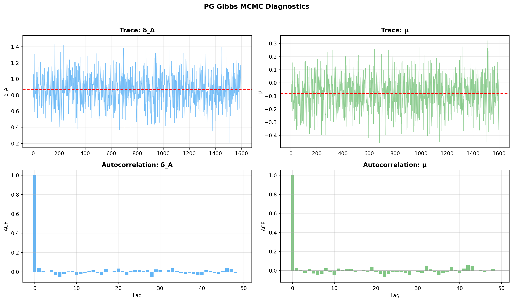
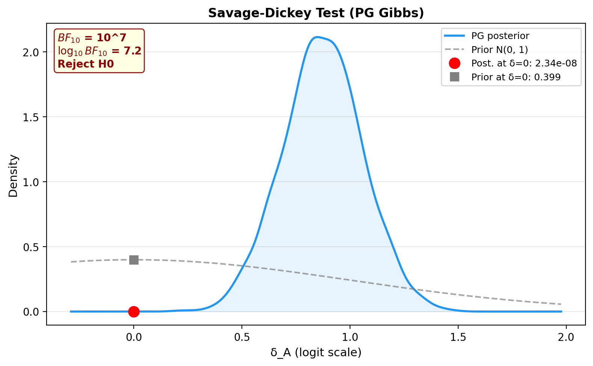
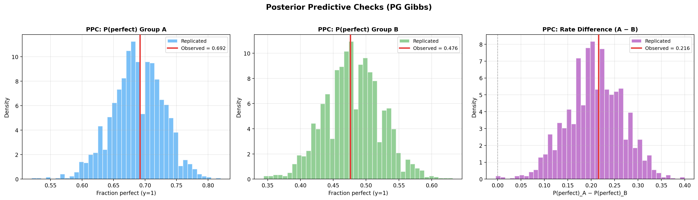
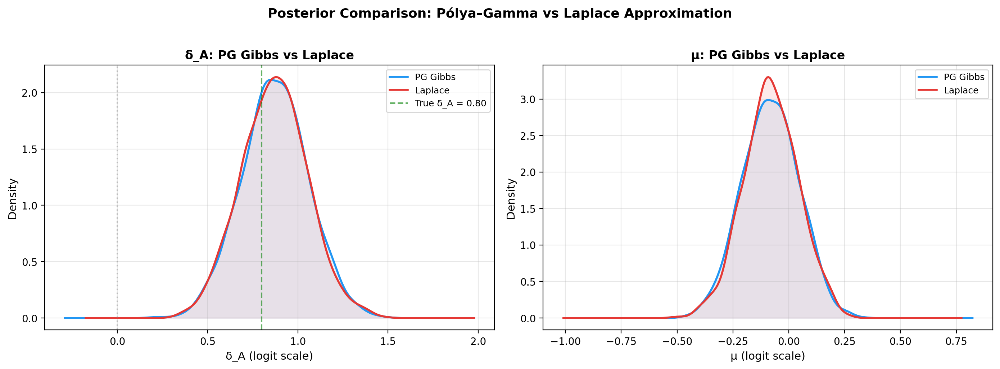
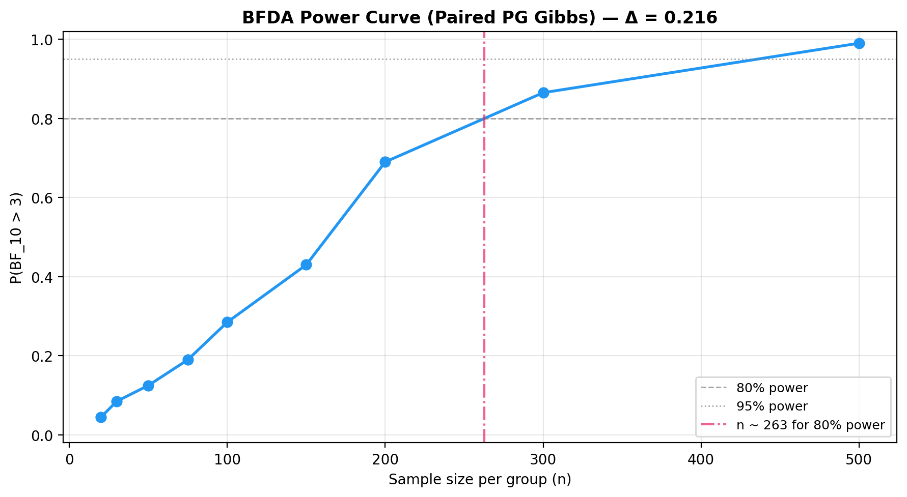
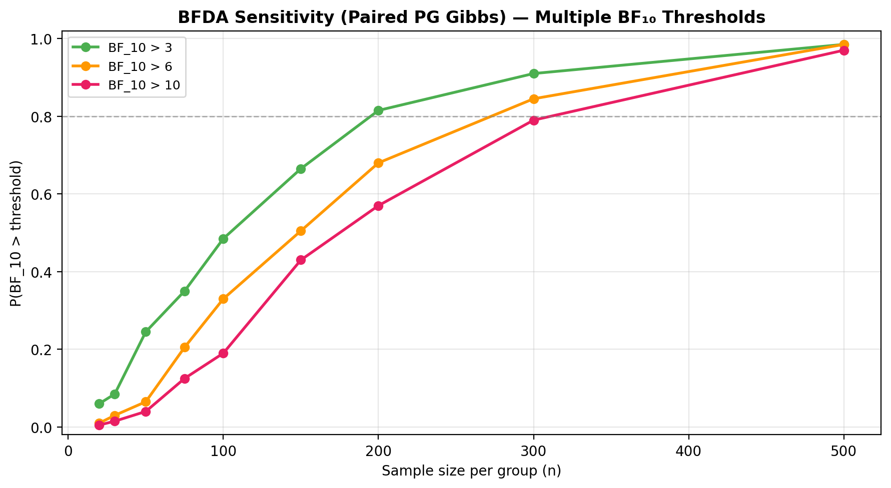

# Paired Model — Pólya-Gamma Gibbs Sampler

## Overview

This model uses the same paired logistic regression as the Laplace variant,
but performs **exact** posterior inference via Pólya-Gamma data augmentation
and Gibbs sampling. It provides multi-chain MCMC diagnostics (R-hat, ESS)
to verify convergence.

## Generative model

$$
\mu \sim \mathcal{N}(0, \sigma_\mu) \qquad
\delta_A \sim \mathcal{N}(0, \sigma_\delta)
$$

$$
y_{A,i} \sim \text{Bernoulli}\bigl(\sigma(\mu + \delta_A)\bigr) \qquad
y_{B,i} \sim \text{Bernoulli}\bigl(\sigma(\mu)\bigr)
$$

### Directed Acyclic Graph (DAG)


<small>**Legend:** grey = hyperparameters, blue = latent parameters, green = deterministic,
yellow = observed data.</small>

## Pólya-Gamma augmentation

### Background

A random variable $\omega \sim \text{PG}(b, c)$ follows a **Pólya-Gamma**
distribution with parameters $b > 0$ and $c \in \mathbb{R}$. Its key
property (Polson, Scott & Windle, 2013) is an integral identity that turns
the logistic likelihood into a Gaussian scale mixture:

$$
\frac{(e^{\psi})^{a}}{(1 + e^{\psi})^{b}}
= 2^{-b} e^{\kappa\psi}
  \int_{0}^{\infty} e^{-\omega\psi^{2}/2}\;
  p(\omega \mid b, 0)\;\mathrm{d}\omega,
\qquad \kappa = a - \tfrac{b}{2}
$$

For a single Bernoulli observation $y_i \in \{0,1\}$ with
$p_i = \sigma(\psi_i) = (1+e^{-\psi_i})^{-1}$, we have $b=1$ and $a = y_i$,
giving $\kappa_i = y_i - \tfrac{1}{2}$.

### Stacked design

We stack the $n$ paired observations into a $2n$-dimensional regression:

$$
\mathbf{y} = \begin{pmatrix} y_{A,1} \\ \vdots \\ y_{A,n} \\ y_{B,1} \\ \vdots \\ y_{B,n} \end{pmatrix},
\qquad
\mathbf{X} = \begin{pmatrix}
1 & 1 \\ \vdots & \vdots \\ 1 & 1 \\
1 & 0 \\ \vdots & \vdots \\ 1 & 0
\end{pmatrix},
\qquad
\boldsymbol{\beta} = \begin{pmatrix} \mu \\ \delta_A \end{pmatrix}
$$

so the linear predictor is $\boldsymbol{\psi} = \mathbf{X}\boldsymbol{\beta}$,
i.e. $\psi_i = \mu + \delta_A$ for the group-A rows and $\psi_i = \mu$ for
the group-B rows, and $\boldsymbol{\kappa} = \mathbf{y} - \tfrac{1}{2}$.

### Prior

The Gaussian prior on $\boldsymbol{\beta}$ is:

$$
\boldsymbol{\beta} \sim \mathcal{N}\!\left(\mathbf{b}_0,\;
\mathbf{B}_0\right),
\qquad
\mathbf{b}_0 = \mathbf{0},
\quad
\mathbf{B}_0 = \begin{pmatrix} \sigma_\mu^{2} & 0 \\ 0 & \sigma_\delta^{2} \end{pmatrix}
$$

with prior precision $\mathbf{B}_0^{-1} = \operatorname{diag}\!\bigl(1/\sigma_\mu^{2},\;1/\sigma_\delta^{2}\bigr)$.

### Gibbs sampler

After augmenting with $\omega_i \sim \text{PG}(1, \psi_i)$, the joint
posterior of $(\boldsymbol{\beta}, \boldsymbol{\omega})$ admits two
tractable full conditionals that are alternated at each sweep:

**Step 1 — Sample auxiliary variables:**

$$
\omega_i \mid \boldsymbol{\beta}, y_i
\;\sim\; \text{PG}\!\bigl(1,\; \mathbf{x}_i^{\top}\boldsymbol{\beta}\bigr),
\qquad i = 1, \dots, 2n
$$

**Step 2 — Sample regression coefficients:**

$$
\boldsymbol{\beta} \mid \boldsymbol{\omega}, \mathbf{y}
\;\sim\; \mathcal{N}\!\bigl(\boldsymbol{\mu}_{\beta},\;
\boldsymbol{\Sigma}_{\beta}\bigr)
$$

where the posterior precision and mean are:

$$
\boldsymbol{\Sigma}_{\beta}^{-1}
= \mathbf{X}^{\top}\!\operatorname{diag}(\boldsymbol{\omega})\,\mathbf{X}
  + \mathbf{B}_0^{-1}
$$

$$
\boldsymbol{\mu}_{\beta}
= \boldsymbol{\Sigma}_{\beta}
  \bigl(\mathbf{X}^{\top}\boldsymbol{\kappa}
        + \mathbf{B}_0^{-1}\,\mathbf{b}_0\bigr)
$$

This is a standard Bayesian weighted least-squares update: the PG
variables $\omega_i$ act as observation weights.  Because both
conditionals are available in closed form, the sampler requires
**no tuning parameters** (unlike Metropolis-Hastings) and mixes well
for logistic models.

### Why it works

Marginalising over $\boldsymbol{\omega}$ recovers the exact logistic
likelihood, so the marginal posterior
$p(\boldsymbol{\beta} \mid \mathbf{y})$ from the Gibbs sampler
targets the true posterior — there is no approximation error beyond
finite MCMC variance.

## MCMC convergence diagnostics

### Gelman-Rubin R-hat

With $m$ independent chains of length $n$, the potential scale reduction
factor is:

$$
\hat{R} = \sqrt{\frac{\hat{\text{var}}^+}{W}}
\qquad\text{where}\qquad
\hat{\text{var}}^+ = \frac{n-1}{n}\,W + \frac{B}{n}
$$

- $B = \frac{n}{m-1}\sum_{c}(\bar{\theta}_c - \bar{\theta})^2$ (between-chain variance)
- $W$ = mean of within-chain variances

**Target:** $\hat{R} < 1.05$

### Effective Sample Size (ESS)

Computed via FFT-based autocorrelation, summing autocorrelation pairs until
they turn negative:

$$
\text{ESS} = \frac{n \cdot m}{1 + 2\sum_{k=1}^{K} \hat{\rho}(k)}
$$

**Target:** ESS > 400

## When to use

- **Exact inference** — no approximation error, exact up to MCMC error
- **Convergence diagnostics** — R-hat and ESS across multiple chains
- **Final analysis** — when you need trustworthy results for reporting

!!! note
    The PG sampler is slower than the Laplace approximation. For exploration,
    start with `PairedBayesPropTest` and switch to `PairedBayesPropTestPG`
    for final analysis.

## Step-by-step example

### 1. Simulate paired data

```python
import numpy as np
from bayesprop.resources.bayes_paired_pg import PairedBayesPropTestPG, sigmoid
from bayesprop.resources.bayes_paired_laplace import PairedBayesPropTest
from bayesprop.utils.utils import simulate_paired_scores

sim = simulate_paired_scores(N=200, delta_A=0.5, sigma_theta=0.0, seed=42)

y_A = sim.y_A
y_B = sim.y_B

print(f"True δ_A = {sim.true_params.delta_A}")
print(f"Fraction y=1:  A={y_A.mean():.1%},  B={y_B.mean():.1%}")
```

### 2. Fit the PG Gibbs model

```python
pg_model = PairedBayesPropTestPG(
    prior_sigma_delta=1.0,
    prior_sigma_mu=2.0,
    seed=42,
    n_iter=2000,
    burn_in=500,
    n_chains=4,
).fit(y_A, y_B)

s = pg_model.summary
print(f"δ_A posterior mean = {s.delta_A_posterior_mean:+.4f}")
print(f"Mean Δ (prob)  = {s.mean_delta:+.4f}")
print(f"95% CI         = [{s.ci_95.lower:.4f}, {s.ci_95.upper:.4f}]")
print(f"P(A>B)         = {s.p_A_greater_B:.4f}")
```

### 3. Unified decision

```python
d = pg_model.decide()

print(f"Bayes Factor:  BF₁₀ = {d.bayes_factor.BF_10:.2f}  → {d.bayes_factor.decision}")
print(f"Posterior Null: P(H₀|D) = {d.posterior_null.p_H0:.4f}  → {d.posterior_null.decision}")
print(f"ROPE:          {d.rope.decision}  ({d.rope.pct_in_rope:.1%} in ROPE)")
```

### 4. MCMC diagnostics

!!! warning "Convergence checks"
    Always verify that **R-hat < 1.05** and **ESS > 400** before
    trusting the results. If convergence is poor, increase `n_iter`
    or `n_chains`.

```python
diag = pg_model.mcmc_diagnostics()
print(f"μ:   R-hat={diag.mu.r_hat:.3f}, ESS={diag.mu.ess:.0f}")
print(f"δ_A: R-hat={diag.delta_A.r_hat:.3f}, ESS={diag.delta_A.ess:.0f}")
```

### 5. Trace and autocorrelation plots

```python
import matplotlib.pyplot as plt

delta_samples = pg_model.delta_A_samples
mu_samples = pg_model.samples[:, 0]

fig, axes = plt.subplots(2, 2, figsize=(14, 8))

# Trace plots
axes[0, 0].plot(delta_samples, alpha=0.6, linewidth=0.5, color="#2196F3")
axes[0, 0].axhline(delta_samples.mean(), color="red", ls="--", lw=1.5)
axes[0, 0].set_ylabel("δ_A")
axes[0, 0].set_title("Trace: δ_A", fontweight="bold")
axes[0, 0].grid(alpha=0.3)

axes[0, 1].plot(mu_samples, alpha=0.6, linewidth=0.5, color="#4CAF50")
axes[0, 1].axhline(mu_samples.mean(), color="red", ls="--", lw=1.5)
axes[0, 1].set_ylabel("μ")
axes[0, 1].set_title("Trace: μ", fontweight="bold")
axes[0, 1].grid(alpha=0.3)

# Autocorrelation
max_lag = 50
for ax, samples, name, color in [
    (axes[1, 0], delta_samples, "δ_A", "#2196F3"),
    (axes[1, 1], mu_samples, "μ", "#4CAF50"),
]:
    centered = samples - samples.mean()
    acf = np.correlate(centered, centered, mode="full")
    acf = acf[len(acf) // 2:]
    acf /= acf[0]
    ax.bar(range(max_lag), acf[:max_lag], color=color, alpha=0.7)
    ax.axhline(0, color="gray", ls="-", lw=0.5)
    ax.set_xlabel("Lag")
    ax.set_ylabel("ACF")
    ax.set_title(f"Autocorrelation: {name}", fontweight="bold")
    ax.grid(alpha=0.3)

fig.suptitle("PG Gibbs MCMC Diagnostics", fontsize=13, fontweight="bold", y=1.02)
plt.tight_layout()
plt.show()
```



Or use the built-in trace plot method:

```python
pg_model.plot_trace()
```

### 6. Savage-Dickey Bayes Factor

```python
pg_model.plot_savage_dickey()
```



### 7. Posterior predictive checks

```python
pg_model.plot_ppc(seed=42)

ppc = pg_model.ppc_pvalues(seed=42)
print(f"{'Statistic':<20} {'Observed':>10} {'p-value':>10} {'Status':>10}")
print("-" * 55)
for stat_name, vals in ppc.items():
    print(f"{stat_name:<20} {vals.observed:>10.4f} {vals.p_value:>10.3f} {vals.status:>10}")
```



## Comparison with Laplace

A key use case for the PG sampler is to verify that the Laplace approximation
gives similar results. Fit both on the same data and compare:

```python
laplace_model = PairedBayesPropTest(seed=42, n_samples=2000).fit(y_A, y_B)

laplace_delta = laplace_model.delta_A_samples
laplace_mu = laplace_model.laplace["mu_samples"]

print("PG Gibbs vs Laplace — posterior summary")
print("=" * 55)
print(f"{'':20} {'PG Gibbs':>15} {'Laplace':>15}")
print("-" * 55)
print(f"{'δ_A mean':20} {delta_samples.mean():>15.4f} {laplace_delta.mean():>15.4f}")
print(f"{'δ_A sd':20} {delta_samples.std():>15.4f} {laplace_delta.std():>15.4f}")
print(f"{'μ mean':20} {mu_samples.mean():>15.4f} {laplace_mu.mean():>15.4f}")
print("=" * 55)
```

### Posterior overlay plot

```python
import matplotlib.pyplot as plt
from scipy.stats import gaussian_kde

fig, axes = plt.subplots(1, 2, figsize=(14, 5))

# δ_A comparison
ax = axes[0]
for samples, label, color in [
    (delta_samples, "PG Gibbs", "#2196F3"),
    (laplace_delta, "Laplace", "#E53935"),
]:
    kde = gaussian_kde(samples)
    x = np.linspace(samples.min() - 0.5, samples.max() + 0.5, 300)
    ax.plot(x, kde(x), linewidth=2, color=color, label=label)
    ax.fill_between(x, kde(x), alpha=0.1, color=color)

ax.axvline(0.5, color="green", ls="--", alpha=0.6, label="True δ_A = 0.5")
ax.axvline(0, color="gray", ls=":", alpha=0.4)
ax.set_xlabel("δ_A (logit scale)")
ax.set_title("δ_A: PG Gibbs vs Laplace", fontweight="bold")
ax.legend(fontsize=9)
ax.grid(alpha=0.3)

# μ comparison
ax = axes[1]
for samples, label, color in [
    (mu_samples, "PG Gibbs", "#2196F3"),
    (laplace_mu, "Laplace", "#E53935"),
]:
    kde = gaussian_kde(samples)
    x = np.linspace(samples.min() - 0.5, samples.max() + 0.5, 300)
    ax.plot(x, kde(x), linewidth=2, color=color, label=label)
    ax.fill_between(x, kde(x), alpha=0.1, color=color)

ax.set_xlabel("μ (logit scale)")
ax.set_title("μ: PG Gibbs vs Laplace", fontweight="bold")
ax.legend(fontsize=9)
ax.grid(alpha=0.3)

fig.suptitle("Posterior Comparison: Pólya–Gamma vs Laplace",
             fontsize=13, fontweight="bold", y=1.02)
plt.tight_layout()
plt.show()
```



### Savage-Dickey comparison

```python
d_pg = pg_model.decide()
d_lp = laplace_model.decide()

print(f"{'':20} {'PG Gibbs':>15} {'Laplace':>15}")
print("-" * 55)
print(f"{'BF₁₀':20} {d_pg.bayes_factor.BF_10:>15.2f} {d_lp.bayes_factor.BF_10:>15.2f}")
print(f"{'BF Decision':20} {d_pg.bayes_factor.decision:>15} {d_lp.bayes_factor.decision:>15}")
print(f"{'ROPE Decision':20} {d_pg.rope.decision:>15} {d_lp.rope.decision:>15}")
```

| Aspect | Laplace | Pólya-Gamma |
|--------|---------|-------------|
| Speed | Fast (milliseconds) | Slower (seconds) |
| Accuracy | Approximate | Exact (up to MCMC) |
| Diagnostics | None | R-hat, ESS |
| Recommended for | Exploration | Final reporting |

## Unified decision comparison

```python
print("Unified Decision — PG Gibbs vs Laplace")
print("=" * 70)

for label, m in [("PG Gibbs", pg_model), ("Laplace", laplace_model)]:
    d = m.decide()
    bf = d.bayes_factor
    pn = d.posterior_null
    rp = d.rope

    print(f"\n{label}:")
    print(f"  Bayes Factor:    BF₁₀ = {bf.BF_10:.2f}  → {bf.decision}")
    print(f"  Posterior Null:   P(H₀|D) = {pn.p_H0:.4f}  → {pn.decision}")
    print(f"  ROPE [{rp.rope_lower:.2f}, {rp.rope_upper:.2f}]:  "
          f"{rp.decision}  ({rp.pct_in_rope:.1%} in ROPE)")
```

## BFDA sample-size planning

```python
from bayesprop.utils.utils import (
    bfda_power_curve,
    plot_bfda_power,
    plot_bfda_sensitivity,
)

theta_A_hat = y_A.mean()
theta_B_hat = y_B.mean()
sample_sizes = [20, 30, 50, 75, 100, 150, 200, 300, 500]

power_curve = bfda_power_curve(
    theta_A_true=theta_A_hat,
    theta_B_true=theta_B_hat,
    sample_sizes=sample_sizes,
    design="paired",
    decision_rule="bayes_factor",
    bf_threshold=3.0,
    n_sim=200,
    n_iter=1000,
    burn_in=300,
    n_chains=2,
    seed=42,
)

plot_bfda_power(
    power_curve, theta_A_hat, theta_B_hat,
    title=f"BFDA Power Curve (Paired PG Gibbs) — Δ = {theta_A_hat - theta_B_hat:.3f}"
)
```



Sensitivity to BF threshold:

```python
plot_bfda_sensitivity(
    theta_A_true=theta_A_hat,
    theta_B_true=theta_B_hat,
    sample_sizes=sample_sizes,
    thresholds=[3.0, 6.0, 10.0],
    n_sim=200,
    seed=42,
    design="paired",
    title="BFDA Sensitivity — Multiple BF₁₀ Thresholds",
)
```



See the [BFDA guide](bfda.md) for the full sample-size planning workflow.

## API

See [API Reference — Paired Model (Pólya-Gamma)](../api/bayes_paired_pg.md) for full method documentation.

## References

1. **Polson, N. G., Scott, J. G. & Windle, J.** (2013). Bayesian inference for logistic models using Pólya-Gamma latent variables. *Journal of the American Statistical Association*, 108(504), 1339–1349.
2. **Windle, J., Polson, N. G. & Scott, J. G.** (2014). Sampling Pólya-Gamma random variates: alternate and approximate techniques. *arXiv:1405.0506*.
