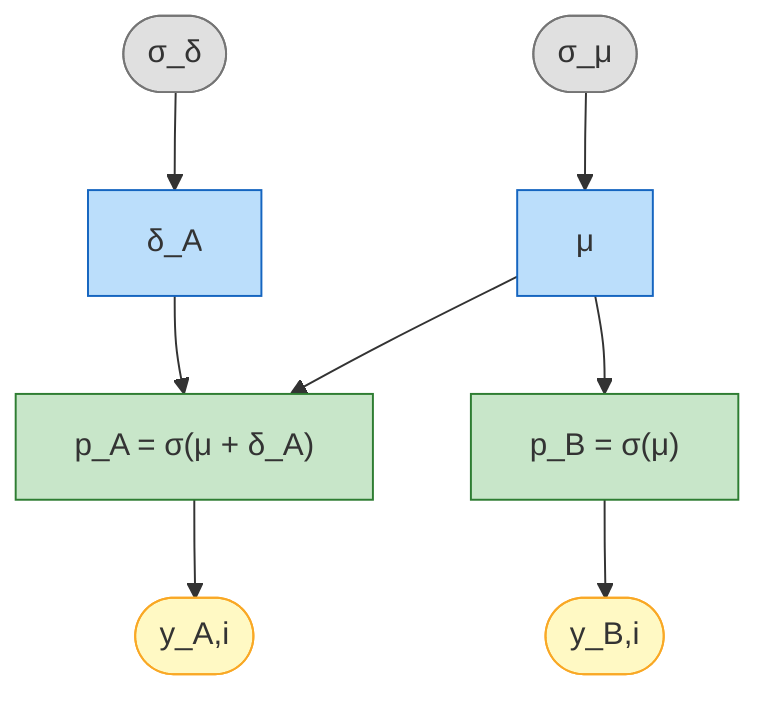

# Paired Model — Pólya-Gamma Gibbs Sampler

## Overview

This model uses the same paired logistic regression as the Laplace variant,
but performs **exact** posterior inference via Pólya-Gamma data augmentation
and Gibbs sampling. It provides multi-chain MCMC diagnostics (R-hat, ESS)
to verify convergence.

## Generative model

\\[
\mu \sim \mathcal{N}(0, \sigma_\mu) \qquad
\delta_A \sim \mathcal{N}(0, \sigma_\delta)
\\]
\\[
y_{A,i} \sim \text{Bernoulli}(\sigma(\mu + \delta_A)) \qquad
y_{B,i} \sim \text{Bernoulli}(\sigma(\mu))
\\]

### Directed Acyclic Graph (DAG)



<small>**Legend:** grey = hyperparameters, blue = latent parameters, green = deterministic,
yellow = observed data.</small>

### Directed Acyclic Graph (DAG)


<small>**Legend:** grey = hyperparameters, blue = latent parameters, green = deterministic,
yellow = observed data.</small>

## When to use

- **Exact inference** — no approximation error, exact up to MCMC error
- **Convergence diagnostics** — R-hat and ESS across multiple chains
- **Final analysis** — when you need trustworthy results for reporting

!!! note
    The PG sampler is slower than the Laplace approximation. For exploration,
    start with `PairedBayesPropTest` and switch to `PairedBayesPropTestPG`
    for final analysis.

## Workflow

```python
from bayesAB.resources.bayes_paired_pg import PairedBayesPropTestPG

model = PairedBayesPropTestPG(
    prior_sigma_delta=1.0,
    prior_sigma_mu=2.0,
    seed=42,
    n_iter=2000,
    burn_in=500,
    n_chains=4,
).fit(y_A, y_B)

# Summary
model.print_summary()

# MCMC diagnostics
diag = model.mcmc_diagnostics()
print(f"μ:   R-hat={diag.mu.r_hat:.3f}, ESS={diag.mu.ess:.0f}")
print(f"δ_A: R-hat={diag.delta_A.r_hat:.3f}, ESS={diag.delta_A.ess:.0f}")

# Hypothesis test
bf = model.savage_dickey_test()
print(f"BF₁₀ = {bf.BF_10:.2f}  →  {bf.decision}")
```

## MCMC diagnostics

!!! warning "Convergence checks"
    Always verify that **R-hat < 1.05** and **ESS > 400** before
    trusting the results. If convergence is poor, increase `n_iter`
    or `n_chains`.

```python
# Trace plots for visual inspection
model.plot_trace()

# Posterior density of δ_A
model.plot_posterior_delta()
```

## Comparison with Laplace

| Aspect | Laplace | Pólya-Gamma |
|--------|---------|-------------|
| Speed | Fast (milliseconds) | Slower (seconds) |
| Accuracy | Approximate | Exact (up to MCMC) |
| Diagnostics | None | R-hat, ESS |
| Recommended for | Exploration | Final reporting |

## API

See [API Reference — Paired Model (Pólya-Gamma)](../api/bayes_paired_pg.md) for full method documentation.
