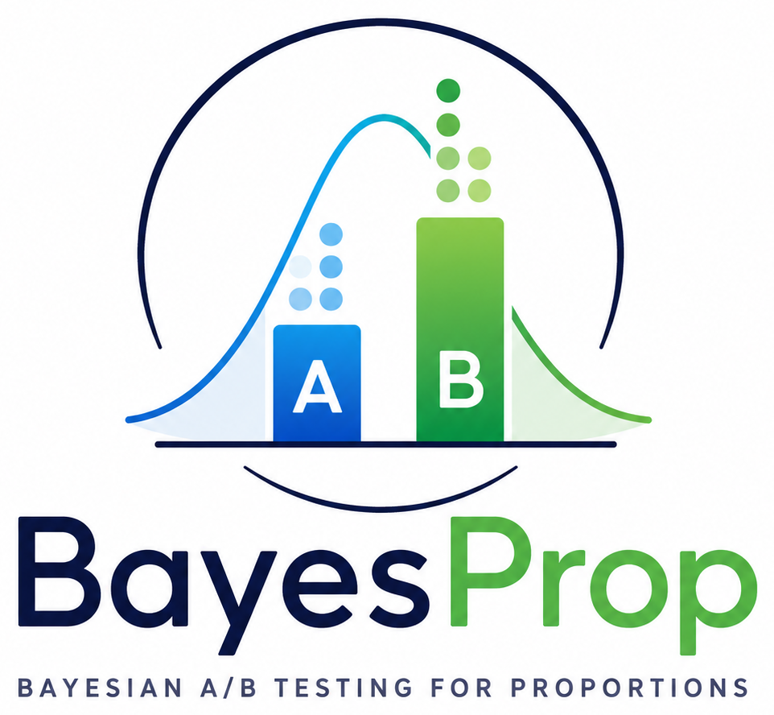

<p align="center">
  
</p>

# Bayesian testing for proportions

A Python package for **Bayesian hypothesis testing** of success-rate differences in any Bernoulli-like experiment,
using analytic and approximate inference methods.
Input data can be **binary** (0/1) or **real-valued on (0, 1)** — continuous scores are automatically binarized at a configurable threshold.
Typical applications include comparing treatments, groups, items, model variants, or any two conditions whose outcomes can be expressed as proportions.

## Features

- **Effect-size inference for proportions** — estimate and test the difference in success rates for both **paired** and **non-paired** samples
- **Hierarchical logistic regression** — optionally place Inverse-Gamma hyperpriors on the prior variances so the model *learns* the prior scales from data, reducing sensitivity to prior choice (Jeffreys–Lindley robustness)
- **Savage–Dickey Bayes Factor** — test a point-null hypothesis ($\delta = 0$) without fitting a separate null model
- **Posterior of the null & ROPE** — quantify the posterior mass inside a Region of Practical Equivalence for nuanced decisions beyond simple reject/accept
- **Posterior predictive checks** — assess model fit by comparing observed data to data simulated from the posterior
- **Bayes Factor Design Analysis (BFDA)** — plan sample sizes to reach a target level of evidence *before* running the experiment
- **Sequential design and decision making** — warm-started, batch-by-batch updates with optional early stopping based on Bayes factor or ROPE thresholds (see `SequentialNonPairedBayesPropTest` and `SequentialPairedBayesPropTest`)
- **Publication-ready plots** — posterior distributions, predictive checks, Savage–Dickey density-ratio plots, and BFDA power curves out of the box

## Quick example

```python
from bayesprop.resources.bayes_nonpaired import NonPairedBayesPropTest
from bayesprop.utils.utils import simulate_nonpaired_scores

sim = simulate_nonpaired_scores(N=100, theta_A=0.85, theta_B=0.70, seed=42)
y_A, y_B = sim.y_A, sim.y_B

model = NonPairedBayesPropTest(seed=42).fit(y_A, y_B)
model.print_summary()

# Unified decision (BF + P(H₀) + ROPE in one call)
d = model.decide()
print(f"BF₁₀ = {d.bayes_factor.BF_10:.2f}  →  {d.bayes_factor.decision}")
print(f"ROPE: {d.rope.decision}  ({d.rope.pct_in_rope:.1%} in ROPE)")
```

## Models at a glance

All paired methods are accessible through a single **unified facade**: `PairedBayesPropTest(method=…)`.

| Model | Class / `method` | Design | Inference |
|-------|--------|--------|-----------|
| `NonPairedBayesPropTest` | `bayes_nonpaired` | Independent groups | Conjugate Beta-Bernoulli |
| `PairedBayesPropTest(method="laplace")` | `bayes_paired` | Paired observations | Laplace approximation (fixed or hierarchical priors) |
| `PairedBayesPropTest(method="pg")` | `bayes_paired` | Paired observations | Pólya-Gamma Gibbs sampler |
| `PairedBayesPropTest(method="bootstrap")` | `bayes_paired` | Paired observations | Nonparametric Bayesian bootstrap |

## Navigation

- [Getting Started](getting_started.md) — installation and first steps
- [User Guide](guide/nonpaired.md) — detailed walkthroughs for each model
- [Decision Rules](guide/decision_rules.md) — ROPE, Bayes factor, and the unified `decide()` API
- [API Reference](api/index.md) — full module documentation

## Citation

If you use **BayesProp** in your research, please cite it. You can use the following BibTeX entry:

```bibtex
@software{vosseler_bayesprop,
  author  = {Vosseler, Alexander},
  title   = {{BayesProp: Bayesian A/B Testing for Proportions}},
  year    = {2026},
  version = {0.1.1.3},
  url     = {https://github.com/AVoss84/bayesProp},
  note    = {Python package}
}
```

Or in plain text:

> Vosseler, A. (2026). *BayesProp: Bayesian A/B Testing for Proportions* (Version 0.1.1.3) [Computer software]. https://github.com/AVoss84/bayesProp
